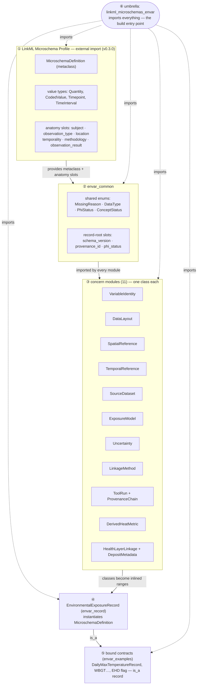
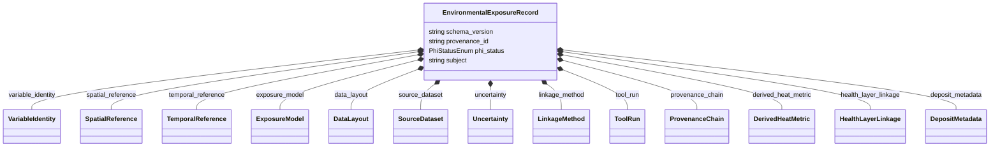
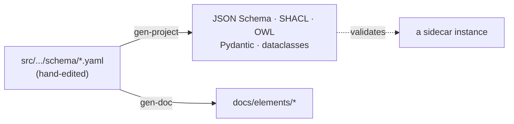

# Architecture — how the microschemas fit together

A bird's-eye view of the EnVar schema set: the layers, how they compose, and the
single composite that ties them together. For detail on any one slot, see the
[generated schema docs](elements/index.md); for the *why* behind the top-level
naming, see the schema `README.md`. This page assumes you are fluent in LinkML.

!!! note "Diagrams"
    The diagrams below are Mermaid; they render on the built site (`just testdoc`
    / `mkdocs serve`), not in a plain Markdown viewer.

---

## 0. Start at the end — the data

The schema exists to describe *something that already exists*: a small table of
values a pipeline has produced. Here is the end product — a daily-maximum-temperature
series for a three-person cohort:

```csv
subject,                 date,        value, unit
cohort:phoenix_aki_2022, 2022-07-19,  46.7,  Cel
cohort:phoenix_aki_2022, 2022-07-20,  45.9,  Cel
cohort:phoenix_aki_2022, 2022-07-21,  47.1,  Cel
```

Two things to fix in mind before any schema appears:

- **The unit of description is the *series*, not the row.** One sidecar describes one
  `(variable, run)` — every value in this file shares the same provenance, geometry,
  model, and semantics. That homogeneity is what makes a single metadata record valid.
- **The values are out-of-band.** They live in the CSV/parquet, not in the sidecar.
  Accordingly the profile's `observation_result` slot is **not bound at all** on the
  record — the sidecar points *at* this file (the required `data_layout` block carries
  the column bindings); it does not duplicate it.

Everything that follows is the metadata graph that makes this file *interpretable and
reproducible*.

---

## 1. Working backwards through the pipeline

The natural way to read a sidecar is to start from the bytes and peel back the pipeline
that produced them. Each arrow below is a question; the next layer is the module that
answers it — walking from the produced value all the way back to the physical quantity.

```mermaid
flowchart LR
  D["DATA (CSV / parquet)<br/>cohort:phoenix · 2022-07-19 · 46.7 Cel"]
  DL["which column holds it?<br/><b>DataLayout</b><br/>wide · value_column=tmax · time_column=date"]
  L["attached to a person — how?<br/><b>LinkageMethod</b><br/>point_extraction_at_residence · geocode 0.95"]
  T["by which run?<br/><b>ToolRun + ProvenanceChain</b><br/>geocoder 3.3.0 → daymet 1.0.0"]
  MO["from which model?<br/><b>ExposureModel</b><br/>spatial_interpolation · warm-bias flagged"]
  S["over which product?<br/><b>SourceDataset</b><br/>Daymet V4 R1 · DOI 10.3334/ORNLDAAC/2129"]
  ST["with which geometry?<br/><b>SpatialReference</b><br/>1 km grid · EPSG:4326 · IDW 4 cells"]
  TE["under which time semantics?<br/><b>TemporalReference</b><br/>daily maximum · day_boundary=local_midnight"]
  V["of which quantity?<br/><b>VariableIdentity</b><br/>air_temperature · time: maximum · Cel"]
  D --> DL --> L --> T --> MO --> S --> ST --> TE --> V
```



Each box is one **microschema module** — a small LinkML schema defining a single class.
The sidecar is those modules composed into one object:

```yaml
# the sidecar that describes the CSV above (top-level keys only)
schema_version: "0.1"
provenance_id: "01HFA7K8R3M6XP-daymet"   # what the health layer's source-value field carries
phi_status: no_phi
subject: "cohort:phoenix_aki_2022"
variable_identity:  { ... }   # VariableIdentity   (profile: observation_type)
spatial_reference:  { ... }   # SpatialReference   (profile: location)
temporal_reference: { ... }   # TemporalReference  (profile: temporality)
exposure_model:     { ... }   # ExposureModel      (profile: methodology)
data_layout:        { ... }   # DataLayout — column bindings into the CSV
source_dataset:     { ... }   # SourceDataset
uncertainty:        { ... }   # Uncertainty
linkage_method:     { ... }   # LinkageMethod
tool_run:           { ... }   # ToolRun
provenance_chain:   { ... }   # ProvenanceChain
derived_heat_metric:{ ... }   # DerivedHeatMetric   (omitted for plain Tmax)
health_layer_linkage:{ ... }  # HealthLayerLinkage
deposit_metadata:   { ... }   # DepositMetadata
# no observation_result — the numbers are in the CSV, located via data_layout
```

---

## 2. The layer cake — how the schema set is built

The modules are not peers in a flat pile; they stack. From the bottom:



| Layer | File(s) | What it contributes |
|---|---|---|
| **① Profile** | external import in `envar_common` | The `MicroschemaDefinition` metaclass (composition without identifiers), the four value types, and the six abstract **anatomy slots**. EnVar conforms to this profile rather than inventing a record pattern. |
| **② Common** | `envar_common` | Cross-cutting enums (`MissingReasonEnum`, `DataTypeEnum`, `PhiStatusEnum`, `ConceptStatusEnum`), the record-root scalar slots, the `missing_reason` slot, and the `AnyValue` passthrough. Every module imports it. |
| **③ Concern modules** | `envar_variable`, `_layout`, `_spatial`, `_temporal`, `_source`, `_model`, `_uncertainty`, `_linkage`, `_toolrun`, `_heat_metric`, `_health_layer` | One concern per file, one (occasionally two) class per file, with its slots, `slot_usage` requireds, and enums. These are the boxes in the pipeline diagram. |
| **④ Composite** | `envar_record` | `EnvironmentalExposureRecord` — realises the profile anatomy under readable domain names and adds the EnVar extension slots. The thing a sidecar instantiates. |
| **⑤ Bound contracts** | `envar_examples` | Concrete `is_a` subclasses that pin specific values (CF triple, heat-metric family) via `rules`. The canonical variables. |
| **⑥ Umbrella** | `linkml_microschemas_envar` | Imports all of the above. The single artifact `gen-project` / `gen-doc` consume. |

---

## 3. The composite, up close

`EnvironmentalExposureRecord` does two jobs: it **realises** the profile's anatomy
slots under readable domain names bound to envar ranges, and it **extends** the record
with envar-specific top-level slots. All composed objects are `inlined: true`
(identifier-free, per the profile).



<small>(Tiers: `variable_identity`, `spatial_reference`, `temporal_reference`,
`exposure_model`, `data_layout`, `source_dataset`, `linkage_method`, `tool_run`,
`subject`, `schema_version`, `provenance_id`, `phi_status` are **core** (required);
`uncertainty`, `provenance_chain`, `health_layer_linkage` are **recommended**;
`derived_heat_metric` is **conditionally-core**; `deposit_metadata` is **optional**.)</small>

**Anatomy-slot realisation.** The four complex anatomy slots are realised as
**readable envar slots** — the validated key is the domain name; the profile name is
carried via slot-level `implements` / `exact_mappings` (and recorded as an `alias`).
`instantiates: MicroschemaDefinition` is a metaclass relation and does not constrain
slot names, so this is profile-conformant (decision recorded in the schema `README.md`
and `issue_naming.md`):

| Record slot (validated key) | Profile slot (`implements`) | `range` | tier |
|---|---|---|---|
| `variable_identity` | `msprofile:observation_type` | `VariableIdentity` | core |
| `spatial_reference` | `msprofile:location` | `SpatialReference` | core |
| `temporal_reference` | `msprofile:temporality` | `TemporalReference` | core |
| `exposure_model` | `msprofile:methodology` | `ExposureModel` | core |
| `subject` | `subject` (used verbatim) | `string` (opaque id) | core |
| — | `observation_result` | **not bound** — values live in the companion file, located via `data_layout` | — |

The remaining concerns have no profile equivalent, so they are added as **extension
slots** directly on the record: `data_layout`, `source_dataset`, `uncertainty`,
`linkage_method`, `tool_run`, `provenance_chain`, `derived_heat_metric`,
`health_layer_linkage`, `deposit_metadata` (plus the root scalars `schema_version`,
`provenance_id`, `phi_status`).

**Bound contracts.** `envar_examples` subclasses the composite to pin canonical variables:

```yaml
DailyMaxTemperatureRecord:
  is_a: EnvironmentalExposureRecord
  rules:                       # pins CF:air_temperature / "time: maximum" / Cel
    - postconditions: { slot_conditions: { variable_identity: { any_of: [ range: VariableIdentity ] } } }
```

(The nested-value pinning is currently a placeholder rule — LinkML cannot yet express
deep slot-condition pinning on an inlined object; see the schema `README.md`.)

---

## 4. Cross-cutting patterns

Four conventions run through every module — know these and the rest is mechanical:

- **Readable domain names at the top level.** The validated keys are the readable envar
  names (`variable_identity`, `spatial_reference`, …); each maps to its profile anatomy
  slot via `implements` / `exact_mappings` — `instantiates` does not constrain slot
  names, so this is profile-conformant. Resolved 2026-07, still open to workshop
  challenge (see `README.md` and `issue_naming.md`).
- **Tiers as annotations.** Every slot carries `annotations: {tier: core | recommended |
  optional | conditionally_core}`. This is the **single source of truth** the completeness
  checker reads — the schema *is* the requirement spec.
- **Null with reason.** Every nullable slot is paired with a `*_missing_reason` slot of
  range `MissingReasonEnum`. A blank is invalid; a null-with-reason is information
  (`not_provided_by_source` ≠ `available_but_not_extracted` ≠ `not_applicable`).
- **Inline, identifier-free composition.** All module objects are `inlined: true`; the
  sidecar is one self-contained graph with no cross-references to resolve.

---

## 5. Build and exports

The umbrella is the only entry point. From it:

- `just gen-project` → JSON Schema, SHACL, OWL TTL, Pydantic, dataclasses, Java, TypeScript.
- `just gen-doc` → the Markdown under `docs/elements/` and a merged schema YAML.

**Edit boundary:** edit `src/linkml_microschemas_envar/schema/*.yaml` only; everything
under `project/`, the generated `datamodel/`, and `docs/elements/` is regenerated.


