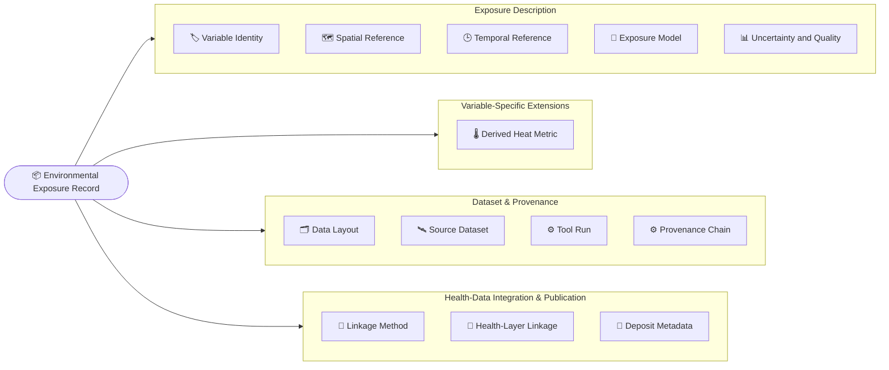

<!-- Auto-generated by scripts/gen_schema_overview.py — do not edit.
     Regenerate with `just gen-schema-overview`. -->

# What the EnVar schema captures

Every environmental exposure value that reaches a health-data system has a
story: *which* physical quantity it is, *where* and *when* it applies, which
upstream product it came from, how it was modelled, linked to patients, and
validated. The **EnVar microschemas** capture that story as a small, PHI-free
metadata *sidecar* that travels with the data.

This page is a plain-language tour of everything the schema records — one
section per microschema, focused on *what is captured* rather than how the
fields are named or constrained. For the technical element-by-element
reference, see the [generated schema docs](elements/index.md).

!!! info "How to read this page"
    Each field row shows its human-readable name (with the technical field
    name and value type in small print), then four columns:

    - **What it captures** — the field's definition, a 💡 plain-terms
      explainer where the definition assumes background knowledge, and
      ↗ links to the standards it leans on
    - **Why it matters** — the justification: what breaks or becomes
      unverifiable when the field is omitted
    - **Examples** — concrete values as they would appear in a sidecar
    - **Priority** — the field's tier:

    - 🟥 **Core** — must be present for the record to be minimally interpretable
    - 🟧 **Core (conditional)** — required whenever the situation applies (e.g. a buffer was used)
    - 🟨 **Recommended** — fill in when available
    - ⬜ **Optional** — nice to have

## At a glance

| Section | What it tells you |
|---|---|
| 📦 [Environmental Exposure Record](#environmental-exposure-record) | The composite record — one variable, one place, one time, one method, fully described. |
| 🏷️ [Variable Identity](#variable-identity) | What was measured — the physical quantity, its units, and how it binds to community vocabularies. |
| 🗂️ [Data Layout](#data-layout) | Where the values live — column bindings between the sidecar and the companion data file. |
| 🗺️ [Spatial Reference](#spatial-reference) | Where the value comes from — grid, projection, and how it was attached to a location. |
| 🕒 [Temporal Reference](#temporal-reference) | When the value applies — temporal grain, aggregation, day boundaries, and calendar. |
| 🛰️ [Source Dataset](#source-dataset) | Which upstream product the value came from — identity, version, DOI, and licence. |
| 🧮 [Exposure Model](#exposure-model) | How the value was produced — the model class, its inputs, and its known biases. |
| 📊 [Uncertainty and Quality](#uncertainty-and-quality) | How much to trust the value — per-value and aggregate uncertainty and quality. |
| 🔗 [Linkage Method (gridded → patient)](#linkage-method-gridded-patient) | How gridded values met patient locations — geocoding, lag alignment, and join rules. |
| ⚙️ [Tool Run and Provenance Chain](#tool-run-and-provenance-chain) | Exactly what ran — the tool invocation and the W3C-PROV provenance chain. |
| 🌡️ [Derived Heat Metric](#derived-heat-metric) | How derived heat metrics were computed — WBGT, Heat Index, UTCI, heat waves. |
| 🏥 [Health-Layer Linkage and FAIR Deposit](#health-layer-linkage-and-fair-deposit) | Where the values landed — the health-data-layer binding and the FAIR deposit. |
| 🧾 [Concrete Example Records](#concrete-example-records) | Ready-made record types for common heat variables. |
| 🧰 [Common Types](#common-types) | Shared building blocks — record identity, PHI safety, and missing-value reasons. |

## 📦 Environmental Exposure Record

**The composite record — one variable, one place, one time, one method, fully described.**

Top-level composite class. Uses readable domain names for the LinkML Microschema Profile anatomy (`variable_identity`, `spatial_reference`, `temporal_reference`, `exposure_model`); each maps back to its profile slot (`observation_type`, `location`, `temporality`, `methodology`) via `implements` / `exact_mappings` — `instantiates` conformance does not constrain slot names. `subject` is used verbatim; `observation_result` is intentionally unbound. Adds the envar top-level slots that compose the full sidecar. Covers §1.1 of envar-heat-scenario-requirements.md.

A single environmental-exposure record sidecar: the complete metadata graph that travels alongside a value (or value series) emitted by an upstream tool. Composes variable identity, data layout, spatial / temporal reference, source dataset, exposure model, uncertainty, linkage, tool run, provenance chain, optional derived-heat-metric methodology, health-data-layer linkage hooks, and FAIR-deposit metadata.

**Standards & references:** [LinkML Microschema Profile](https://github.com/linkml/linkml-microschema-profile)

### Exposure Description

*What was measured, for whom, where, when, and how — the generic scientific anatomy shared by every exposure record, whatever the variable.*

| Field | What it captures | Why it matters | Examples | Priority |
|---|---|---|---|---|
| **Subject (Patient or Cohort)** <small>`subject` · text</small> | The patient or cohort the exposure value is attached to. Carried as an opaque identifier; PHI must not appear here. 💡 *Who (or what group) the values belong to — a study cohort or an individual patient, named by an anonymous code rather than anything identifying.*  ❓ **Open question (draft — feedback welcome):** `subject` is the only field in this group that is not a per-value predicate: every other field explains an individual value, but a single scalar subject is dataset-scoped and cannot distribute over the sidecar's rows (per-row subject identity lives in `subject_column`). Under review — should it be dropped, or demoted to a dataset-level cohort handle? Feedback welcome. | An exposure value is meaningless without knowing whose exposure it is. The opaque handle is what lets the sidecar be joined back to the right cohort or patient in the health-data layer while staying PHI-free. | `cohort:phoenix_aki_2022` — an opaque cohort handle — no PHI | 🟥 Core *(required)* |
| **Variable Identity** <small>`variable_identity` · [Variable Identity](#variable-identity) block</small> | The variable identity object — what physical quantity is being captured. Bound to VariableIdentity (see envar_variable). Readable rename of the profile's `observation_type` anatomy slot. 💡 *This block pins down exactly what was measured. Instead of relying on a nickname like "tmax", it uses shared vocabularies to say "daily maximum air temperature, in degrees Celsius", so any tool or researcher reads it the same way.* ↗ [CF Conventions](https://cfconventions.org/) · [UCUM](https://ucum.org/) | Without a standard variable identity, "tmax" in one file and "TMAX" in another cannot be recognised as the same physical quantity, and unit mix-ups (Celsius vs Fahrenheit vs Kelvin) go undetected — pooling and cross-study comparison silently break. | abridged — see tests/data/valid/EnvironmentalExposureRecord-tmax_ideal.yaml for a full instance | 🟥 Core *(required)* |
| **Spatial Reference** <small>`spatial_reference` · [Spatial Reference](#spatial-reference) block</small> | Spatial reference object describing the native grid and extraction. Bound to SpatialReference (see envar_spatial). Readable rename of the profile's `location` anatomy slot. 💡 *This block says where the number applies and how it was pulled out of a map. Environmental data usually comes as a grid of cells covering a region; this records how big those cells are and how the value for a specific place was picked from them.* ↗ [EPSG Registry](https://epsg.io/) | A value without its grid, coordinate system, and extraction method cannot be located or compared: a 1 km neighbourhood average and a ~31 km regional average look identical as numbers but describe very different exposures, and the extraction cannot be re-run without the method. | abridged — see tests/data/valid/EnvironmentalExposureRecord-tmax_ideal.yaml for a full instance | 🟥 Core *(required)* |
| **Temporal Reference** <small>`temporal_reference` · [Temporal Reference](#temporal-reference) block</small> | Temporal reference object describing resolution, aggregation, and day-boundary convention. Bound to TemporalReference (see envar_temporal). Readable rename of the profile's `temporality` anatomy slot. 💡 *This block explains the time ruler behind each value: how long a period each number summarises (a day, a month), how it was summarised (maximum, mean), and — surprisingly important — when a "day" is considered to start and end.* ↗ [CF Conventions](https://cfconventions.org/) | A "daily maximum" is ambiguous without the day-boundary convention: Daymet days end at local midnight while PRISM days end at 12:00 GMT, so the same calendar date can cover different physical hours — the most-omitted detail in the heat literature and a known source of cross-product disagreement. | abridged — see tests/data/valid/EnvironmentalExposureRecord-tmax_ideal.yaml for a full instance | 🟥 Core *(required)* |
| **Exposure Model** <small>`exposure_model` · [Exposure Model](#exposure-model) block</small> | The exposure-model object describing how values were produced. Bound to ExposureModel (see envar_model). Readable rename of the profile's `methodology` anatomy slot, narrowed to the model itself: other methodology-adjacent concerns (source dataset, tool run, provenance chain, derived heat metric) are surfaced as separate envar-extension slots. 💡 *Most exposure values are not direct readings from an instrument at someone's house — they are estimates computed from weather stations, satellites, or models. This block says which estimation method produced the numbers and what went into it.* | The same quantity can be estimated by station interpolation, satellite retrieval, or model reanalysis, each with different inputs and biases; without the model description, values from different products get pooled as if equivalent and their systematic differences stay invisible. | abridged — see tests/data/valid/EnvironmentalExposureRecord-tmax_ideal.yaml for a full instance | 🟥 Core *(required)* |
| **Uncertainty** <small>`uncertainty` · [Uncertainty and Quality](#uncertainty-and-quality) block</small> | Uncertainty object — see envar_uncertainty. 💡 *No estimate is perfect. This block says how far off the numbers might be and what was done about gaps in the data, so users know how much confidence to place in each value.* | Exposure values are model estimates with error; without recorded per-value or aggregate uncertainty and missing-data handling, downstream analyses treat estimates as exact, and exposure-measurement error propagates invisibly into health-effect estimates. | abridged — see tests/data/valid/EnvironmentalExposureRecord-tmax_ideal.yaml for a full instance | 🟨 Recommended |

### Variable-Specific Extensions

*Methodology blocks that only apply to particular variable families — present when the variable calls for them, omitted otherwise. Today that is derived heat metrics; future families (air quality, pollen, …) plug in here the same way.*

| Field | What it captures | Why it matters | Examples | Priority |
|---|---|---|---|---|
| **Derived Heat Metric** <small>`derived_heat_metric` · [Derived Heat Metric](#derived-heat-metric) block</small> | Heat-metric methodology, present when the variable is a derived heat metric — see envar_heat_metric. Omitted for non-heat variables. 💡 *Some heat measures are not read from a thermometer but calculated from several ingredients (temperature, humidity, wind, sunshine) using a chosen formula. This block records which formula and ingredients were used — it is only needed when the variable is one of these computed heat metrics.* | Heat metrics like WBGT or Heat Index can be computed by several non-equivalent equations from different inputs, and heat-wave flags depend on the threshold definition; the heat-epidemiology literature flags these choices as the main sources of cross-study disagreement, so omitting the block for a heat metric makes the record uncomparable. | illustrative outdoor-WBGT methodology block — not part of the tmax scenario, where this slot is omitted | 🟧 Core (conditional) |

### Dataset & Provenance

*Where the values live and come from — the companion file's column layout, the upstream product, and the exact tool runs that produced the values.*

| Field | What it captures | Why it matters | Examples | Priority |
|---|---|---|---|---|
| **Data Layout** <small>`data_layout` · [Data Layout](#data-layout) block</small> | Data-layout object binding this sidecar to the columns of the companion data file — see envar_layout. Required: without it a consumer cannot locate the values the sidecar describes. 💡 *The actual numbers live in a separate data table that travels with this record. This block is the map between the two: it names which column holds the values, which holds the person identifier, which holds the date, and so on.* | The sidecar describes values that live in a companion CSV/parquet file; without the column bindings a consumer cannot tell which column holds the values, subjects, or dates, so the metadata is unanchored and the data unusable — hence the slot is required. | abridged — see tests/data/valid/EnvironmentalExposureRecord-tmax_ideal.yaml for a full instance | 🟥 Core *(required)* |
| **Source Dataset** <small>`source_dataset` · [Source Dataset](#source-dataset) block</small> | Source dataset object — see envar_source. 💡 *Exposure values are derived from a published data product (for example Daymet, a daily weather dataset). This block names that product precisely — including its version, citation, and license — so anyone can find it and check its documentation.* ↗ [SPDX Licence List](https://spdx.org/licenses/) · [DOI Foundation](https://www.doi.org/) | Without the upstream product's identity, version, DOI, and license, the record cannot be cited, its documented biases cannot be looked up, and reuse terms are unknown — and two records built from different product versions cannot be told apart. | abridged — see tests/data/valid/EnvironmentalExposureRecord-tmax_ideal.yaml for a full instance | 🟥 Core *(required)* |
| **Tool Run** <small>`tool_run` · [Tool Run](#tool-run) block</small> | The current ToolRun — see envar_toolrun. 💡 *This block is the receipt for the software step that produced the values: which program ran, which exact version, with what settings, and when. With it, someone else can re-run the same step and get the same numbers.* | Without the exact tool name, version, container image, parameters, and timestamp, the record cannot be re-run: "we used the daymet tool" is not reproducible, but a pinned container invocation is. | abridged — see tests/data/valid/EnvironmentalExposureRecord-tmax_ideal.yaml for a full instance | 🟥 Core *(required)* |
| **Provenance Chain** <small>`provenance_chain` · [Provenance Chain](#provenance-chain) block</small> | Ordered W3C-PROV-style chain of upstream tool runs — see envar_toolrun. Recommended (not required): a record is reproducible in principle without the full chain, but real reproduction needs it. 💡 *Data usually passes through several tools before the final value appears — download, geocode, extract. This block lists those earlier steps in order, like a chain of custody reaching back to the original raw source.* ↗ [W3C PROV-O](https://www.w3.org/TR/prov-o/) | The final tool run is rarely the whole story — downloads, geocoding, and intermediate transforms precede it; without the ordered chain back to the raw source, end-to-end reproduction and error tracing are impossible even when the last step is pinned. | abridged — see tests/data/valid/EnvironmentalExposureRecord-tmax_ideal.yaml for a full instance | 🟨 Recommended |

### Health-Data Integration & Publication

*How the record meets patient data and travels onward — the gridded-to-patient join, the downstream health-layer hooks, and the FAIR deposit.*

| Field | What it captures | Why it matters | Examples | Priority |
|---|---|---|---|---|
| **Linkage Method** <small>`linkage_method` · [Linkage Method](#linkage-method-gridded-patient) block</small> | Linkage-method object — see envar_linkage. 💡 *Environmental data describes places, but health research is about people. This block records how the value for a place was attached to a particular person — for example, by looking up the map cell containing their home address — since that step involves real choices that affect the result.* | Attaching a place-based value to a person is a lossy, choice-laden step (geocoding, point vs buffer extraction, date alignment) — the "linkage descriptor" gap the GECC/EIRENE forum names as central. Without it, two studies using the same data product can differ solely through undocumented joins. | abridged — see tests/data/valid/EnvironmentalExposureRecord-tmax_ideal.yaml for a full instance | 🟥 Core *(required)* |
| **Health-Layer Linkage** <small>`health_layer_linkage` · [Health-Layer Linkage](#health-layer-linkage) block</small> | Downstream health-data-layer linkage hooks (OMOP, BDC, …) — see envar_health_layer. Optional: its members are Recommended/Optional, and the Core PHI assertion lives at the record root (`phi_status`). 💡 *Health studies keep patient data in large standard databases. This block notes which of those systems the exposure values were wired into and through which field, so someone browsing the health data can find their way back to this record.* ↗ [OMOP CDM](https://ohdsi.github.io/CommonDataModel/) · [BioData Catalyst](https://biodatacatalyst.nhlbi.nih.gov/) | Naming the downstream health-data layer (OMOP, BDC, …) and the join field makes the exposure record findable from the clinical side; without it the sidecar and the health records it serves drift apart, and the link must be reconstructed by hand. | abridged — see tests/data/valid/EnvironmentalExposureRecord-tmax_ideal.yaml for a full instance | 🟨 Recommended |
| **FAIR Deposit Metadata** <small>`deposit_metadata` · [Deposit Metadata](#deposit-metadata) block</small> | FAIR-deposit metadata, present when the sidecar is intended to travel with a published deposit — see envar_health_layer. 💡 *If this record and its data are published in a public archive (such as Zenodo), this block holds the publication details: the permanent DOI link, where it lives, and the license saying how others may use it.* ↗ [FAIR Principles](https://www.go-fair.org/fair-principles/) | When the sidecar travels with a published deposit, the DOI, repository, and license are what make the object findable, citable, and legally reusable — omitting them strands a public artifact without citation or reuse terms. Optional because most records are never deposited. | abridged — see tests/data/valid/EnvironmentalExposureRecord-tmax_ideal.yaml for a full instance | ⬜ Optional |

### Record Identity & Safety

*Sidecar bookkeeping — the schema version the record conforms to, its stable identifier, and the record-level PHI safety assertion.*

| Field | What it captures | Why it matters | Examples | Priority |
|---|---|---|---|---|
| **Schema Version** <small>`schema_version` · text</small> | The version of the EnVar micro-schema this document conforms to. Required on every sidecar so downstream consumers can branch on schema evolution. 💡 *Schemas change over time, like editions of a paper form. This is the edition number stamped on the document, so anyone reading it knows exactly which version of the form was filled in and can interpret the fields accordingly.* ↗ [semver.org](https://semver.org/) | Downstream consumers must branch on schema evolution: a parser built for one version will silently misread or wrongly reject sidecars written against another. Without this slot there is no way to tell which iteration of the schema a document targets. | `0.1` | 🟥 Core *(required)* |
| **Record Identifier** <small>`provenance_id` · text</small> | Stable identifier for this sidecar / record (ULID recommended). This is the value the downstream health-data layer's source-value field carries to link a row back to its provenance (for OMOP, that field is `external_exposure.exposure_source_value`). 💡 *A unique serial number for this metadata document, like the tracking number on a parcel. Wherever the data value ends up, that number lets you look up exactly where it came from and how it was made.* ↗ [ULID](https://github.com/ulid/spec) · [OMOP CDM](https://ohdsi.github.io/CommonDataModel/) | This identifier is what the downstream health-data layer's source-value field carries (for OMOP, `external_exposure.exposure_source_value`); it is the only hook that links an exposure value in the health layer back to its full spatial, temporal, and model provenance. Omit it and the value becomes untraceable — its metadata can never be recovered. | `01HFA7K8R3M6XP-daymet-deposit` — ULID-based sidecar identifier for the Daymet Tmax deposit | 🟥 Core *(required)* |
| **PHI Status** <small>`phi_status` · [PHI Status](#phi-status) value</small> | Whether the sidecar carries any Protected Health Information. A record-level safety assertion; by design, sidecars are PHI-free. 💡 *PHI (protected health information) means private medical details about an identifiable person. This flag is a written promise on the document saying "no private patient information inside", so it can be passed around and published safely.* ↗ [hhs.gov](https://www.hhs.gov/hipaa/for-professionals/privacy/index.html) | Sidecars are designed to be PHI-free, and this slot is the explicit machine-readable assertion of that. Without it, every sharing, deposit, or export step must treat the document as potentially containing patient data and re-review it manually before it can leave a protected environment. | `no_phi` | 🟥 Core *(required)* |

## 🏷️ Variable Identity

**What was measured — the physical quantity, its units, and how it binds to community vocabularies.**

Variable identity slots: standard-name CURIE (CF where it exists, ENVAR or ontology terms otherwise), UCUM units, target-vocabulary concept id + status, generic concept cross-references, plausible value range, value data type. Identity only — the binding to columns in the companion data file lives in envar_layout. Covers §2 of envar-heat-scenario-requirements.md.

The identity and semantics of an environmental exposure variable — what physical quantity is being captured, in what units, and how it binds to community vocabularies. One per record.

**Standards & references:** [CF Standard Names](https://cfconventions.org/standard-names.html) · [UCUM](https://ucum.org/)

| Field | What it captures | Why it matters | Examples | Priority |
|---|---|---|---|---|
| **Variable Name** <small>`variable_name` · text</small> | Short machine-readable name for the variable, usually the name the upstream tool uses for it (e.g. `tmax`, `tmmx`, `air.2m`). Identity only — not necessarily the column header in the companion data file; that binding lives in `DataLayout.value_column` (see envar_layout). 💡 *Data tools give each measurement a short nickname, like `tmax` for maximum temperature. This is that nickname, written down exactly as the tool spells it, so you can go back to the source and find the same measurement again.* | This is the handle under which the upstream product knows the variable (Daymet `tmax` vs gridMET `tmmx`). Without it the record cannot be traced back to the source product's variable, and a rerun cannot request the same quantity from the tool. | `tmax` — Daymet daily maximum air temperature variable | 🟥 Core *(required)* |
| **Variable Label** <small>`variable_label` · text</small> | Human-readable label, e.g. "daily maximum air temperature at 2 m". 💡 *A friendly, spelled-out name for the measurement — like "daily maximum air temperature at 2 m" instead of the cryptic code `tmax` — so anyone reading the record knows what it is without decoding jargon.* | Terse tool codes like `tmmx` are easy to misread (maximum vs mean) and force readers to consult external tool documentation. A plain-language label lets a human verify at a glance that the record describes the intended quantity. | `daily maximum air temperature at 2 m` | 🟨 Recommended |
| **Standard Name** <small>`standard_name` · identifier (CURIE / URI)</small> | The standard-name identifier for the physical quantity, as a CURIE so the schema privileges no single naming authority. Use a CF Convention Standard Name where one exists (`CF:air_temperature`, `CF:relative_humidity`); for health-relevant quantities CF does not define (e.g. Heat Index, WBGT), mint a term in the project registry (`ENVAR:heat_index`) or reuse an ontology term (`ECTO:...`). The prefix carries the authority; the slot name does not. Mandatory. 💡 *Different tools use different nicknames for the same thing, so scientific communities maintain shared official names for physical quantities (like "air_temperature"). Tagging the record with the official name lets computers tell that two datasets measure the same thing, no matter what each dataset called it.* ↗ [CF Standard Names](https://cfconventions.org/standard-names.html) · [ECTO](https://obofoundry.org/ontology/ecto.html) | This is the cross-agency identifier that makes the variable interoperable: without it, `tmax` from one product and `tmmx` from another cannot be recognised by machines as the same physical quantity, so records cannot be pooled or harmonised across studies. | `CF:air_temperature` — CF Standard Name for the Daymet daily Tmax scenario `CF:mass_concentration_of_pm2p5_ambient_aerosol_particles_in_air` — CF Standard Name for the ACAG PM2.5 scenario | 🟥 Core *(required)* |
| **CF Cell Methods** <small>`cf_cell_methods` · text</small> | CF `cell_methods` string describing how the value summarises sub-period values, e.g. `time: maximum` for Tmax, `time: mean` for daily mean. 💡 *A "daily temperature" value could be the day's highest reading, its average, or its lowest — very different numbers. This short standard phrase (like "time: maximum") records which one it is, in the exact wording that climate-data software already understands.* ↗ [CF cell_methods](https://cfconventions.org/cf-conventions/cf-conventions.html#cell-methods) | A daily maximum and a daily mean of the same quantity carry the same standard name and units; only the aggregation statement tells them apart. Keeping the verbatim CF string also enables round-tripping against CF/NetCDF source products and the CF-consistency triple check over `standard_name` + `cf_cell_methods` + `units_ucum`. | `time: maximum` — daily maximum (Tmax) `time: mean` — mean over the aggregation period (e.g. annual-mean PM2.5) | 🟥 Core |
| **Units (UCUM)** <small>`units_ucum` · text</small> | The unit expressed in UCUM syntax, e.g. `Cel` for degrees Celsius, `K` for Kelvin, `ug/m3` for PM2.5 mass concentration. 💡 *UCUM is a compact, machine-readable spelling of the unit — `Cel` for degrees Celsius, `ug/m3` for micrograms per cubic metre — so software can convert °C to °F or check units automatically without guessing what a human-written unit string means.* ↗ [UCUM](https://ucum.org/) | A number without units is uninterpretable — a value of 35 could be °C or °F, a factor-of-1.8 error in an exposure analysis. UCUM is the machine-readable form that health-data layers (e.g. OMOP's unit_concept_id) align to, so omitting it also blocks automated unit conversion and downstream integration. | `Cel` — degrees Celsius (Daymet Tmax) `ug/m3` — micrograms per cubic metre (PM2.5 mass concentration) | 🟥 Core *(required)* |
| **Display Units** <small>`units_display` · text</small> | Human-readable unit string for display purposes, e.g. `°C`. 💡 *The pretty version of the unit for people to read, like "°C". The machine version (`Cel`) is stored separately; this one exists purely for showing on screen or in print.* | Keeps human-facing output (tables, plots, reports) readable without every consumer having to translate UCUM codes; omitting it risks each tool rendering the unit differently or mislabelling axes. | `°C` | ⬜ Optional |
| **Target Concept Vocabulary** <small>`target_concept_vocabulary` · text</small> | The downstream health-data vocabulary that `target_concept_id` and `concept_status` refer to, e.g. `omop` (OHDSI Standardised Vocabulary), `bdc` (BioData Catalyst). Names the vocabulary so the schema privileges no single health-data layer. 💡 *Health databases each keep their own catalogue of codes for the things they record. This slot says which catalogue the record's health-data code (and its status) comes from — for example the OMOP catalogue used by many hospital research databases.* ↗ [OHDSI Athena](https://athena.ohdsi.org/) · [BioData Catalyst](https://biodatacatalyst.nhlbi.nih.gov/) | `target_concept_id` and `concept_status` are meaningless without knowing which vocabulary they refer to; naming it explicitly keeps the record portable across health-data layers (OMOP, BDC, ...) instead of silently assuming one. | `omop` — OHDSI Standardised Vocabulary (OMOP CDM) | 🟨 Recommended |
| **Target Concept Identifier** <small>`target_concept_id` · text</small> | Concept identifier for the variable in the vocabulary named by `target_concept_vocabulary` (e.g. an OHDSI concept_id). Nullable with reason for environmental variables that lack coverage today. 💡 *Health databases store everything under numeric codes from a shared catalogue. This is that code for the environmental measurement, when one exists, so the exposure value can sit alongside clinical data under an identifier the database already knows.* ↗ [OHDSI Athena](https://athena.ohdsi.org/) | This is the hook that lets the environmental value land in a health database as a recognised concept. Recording it — or its documented absence — shows whether the vocabulary binding was attempted and against what, instead of leaving the linkage silent and unreproducible. | `2005200123` — illustrative OHDSI concept_id; in the canonical Tmax and PM2.5 scenarios this slot is null with a missing reason | 🟨 Recommended |
| **Reason Concept ID Is Missing** <small>`target_concept_id_missing_reason` · [Missing-Value Reason](#missing-value-reason) value</small> | Reason `target_concept_id` is null. Distinguishes "no concept yet exists in the target vocabulary" from "the pipeline did not resolve it". 💡 *When a code is missing, it matters why. This slot records the reason — for example that no such code has been invented yet — so an empty field is not mistaken for a processing mistake.* | Without a stated reason, a null `target_concept_id` is ambiguous: downstream users cannot tell a genuine vocabulary gap from a pipeline that simply failed to look the concept up, and so cannot decide whether to fix the data or request a new concept. | `not_provided_by_source` | ⬜ Optional |
| **Concept Status** <small>`concept_status` · [Concept Status](#concept-status) value</small> | Status of this variable's coverage in the target health-data vocabulary (`existing` / `proposed` / `gap`). Makes the vocabulary gap explicit rather than silent. Required. 💡 *A simple status flag saying whether the health-data catalogue already has a code for this measurement, has one in the works, or has nothing yet. It turns a silent gap into an explicit, reportable fact.* | A downstream system must know whether to expect a concept id. The explicit existing/proposed/gap status makes vocabulary gaps visible and countable rather than silently null — which is what drives vocabulary-extension requests for environmental variables. | `gap` — no OMOP concept exists yet for daily Tmax | 🟥 Core *(required)* |
| **Concept Cross-References** <small>`concept_mappings` · list of identifier (CURIE / URI)</small> | Cross-references binding this variable to other vocabularies and ontologies, each as a CURIE. One generic list rather than a slot per standard, so adding a vocabulary is a new prefix, not a schema change. Examples: `ECTO:0000012` (Environmental Conditions, Treatments and Exposures Ontology — cross-Monarch / cross-CHORDS alignment), `ENVO:01000339` (Environment Ontology — material or process exposed to), `LOINC:...` / `SNOMED:...` (where the variable has clinical coverage). Note: the *primary* downstream health-data binding, with its `existing` / `proposed` / `gap` status, stays in the structured `target_concept_*` slots — this list is for additional, status-free cross-references. 💡 *Different scientific communities keep different dictionaries of concepts. This is a list of "also known as" links pointing to the matching entries in those dictionaries, so people searching any of them can still find this measurement.* ↗ [ECTO](https://obofoundry.org/ontology/ecto.html) · [ENVO](https://obofoundry.org/ontology/envo.html) · [LOINC](https://loinc.org/) | Cross-references to ontologies (ECTO, ENVO) and clinical codes (LOINC, SNOMED) let the variable be found and aligned across projects and communities; without them, cross-study harmonisation has to be redone by hand. Enrichment only — not needed to reproduce the value. | `ECTO:0000012` — exposure to temperature (ECTO) — one element of the cross-reference list for the Daymet daily Tmax scenario `ENVO:03000049` — temperature of air (ENVO) — a second element of the same cross-reference list | ⬜ Optional |
| **Value Data Type** <small>`value_data_type` · [Value Data Type](#value-data-type) value</small> | The data type of the stored exposure value. 💡 *Says what kind of value to expect: a decimal number that can take any value (like a temperature), a yes/no flag, or a category. Software needs this to know how to read and summarise the data correctly.* | Tells consumers how to parse and analyse the values — continuous numbers, categories, and flags need different statistics and storage. Omitting it forces guessing from the data, which fails on ambiguous cases like 0/1 columns (count, flag, or category?). | `continuous_numeric` | 🟥 Core *(required)* |
| **Plausible Minimum Value** <small>`value_range_plausible_min` · number</small> | Physical / domain lower bound for plausible values (e.g. -50 °C for ambient Tmax). Not a hard validation bound; sanity-check signal. 💡 *The lowest value that would still make physical sense — for example -50 °C for outdoor air temperature. Anything below it is probably an error; this is a warning signal, not a hard rule.* | Gives automated quality checks a sanity band: without it, unit mix-ups and corrupted values (e.g. a Tmax of 350 from unconverted Kelvin) pass silently into downstream analyses. | `-50` — plausible lower bound for ambient Tmax in °C | 🟨 Recommended |
| **Plausible Maximum Value** <small>`value_range_plausible_max` · number</small> | Physical / domain upper bound for plausible values (e.g. 60 °C for ambient Tmax). 💡 *The highest value that would still make physical sense — for example 60 °C for outdoor air temperature. Anything above it likely signals a unit mix-up or a data error worth investigating.* | Together with the plausible minimum, this gives automated quality checks a sanity band: without it, unit mix-ups and corrupted values slip silently past validation into exposure analyses. | `60` — plausible upper bound for ambient Tmax in °C | 🟨 Recommended |

## 🗂️ Data Layout

**Where the values live — column bindings between the sidecar and the companion data file.**

Column bindings between the sidecar and the companion data file: which column carries the values, how long-format rows are discriminated, and where the subject / time / uncertainty / QA-flag columns live. Pure file layout — variable identity stays in envar_variable; file-level identity (hashes, row counts) stays in envar_toolrun.

How the companion data file (CSV / parquet) is laid out and how this record's values are located inside it. Separates the file-layout concern from variable identity: `VariableIdentity.variable_name` says what the variable is; `DataLayout` says which column (and, for long format, which rows) carry its values. One per record.

| Field | What it captures | Why it matters | Examples | Priority |
|---|---|---|---|---|
| **Table Orientation** <small>`table_orientation` · [Table Orientation](#table-orientation) value</small> | Whether the companion file is wide (one column per variable) or long (one `value` column, variables discriminated by row). Required. 💡 *Wide means one column per measurement type (a `tmax` column, a `vp` column, and so on); long means one row per measurement, with a shared `value` column and a label column saying which measurement each row is. Long is also known as "tidy" format.* ↗ [DOI Foundation](https://doi.org/10.18637/jss.v059.i10) | Every other column binding in this class is read relative to the orientation: in a wide file `value_column` names a variable-specific column, in a long file it names a shared column whose rows must be filtered. Without this flag a consumer cannot interpret the bindings and so cannot reliably locate this record's values in the companion file. | `wide` — one column per variable, e.g. a `tmax` column in a Daymet extract `long` — tidy format with a shared `value` column, e.g. tract-level PM2.5 | 🟥 Core *(required)* |
| **Value Column** <small>`value_column` · text</small> | Name of the column carrying this record's exposure values, e.g. `tmax` in a wide file or `value` in a long file. Required. 💡 *This is simply the name of the spreadsheet column where the actual numbers live — for example a column headed `tmax` holding daily maximum temperatures, or a generic column headed `value` in a long table.* | The record deliberately carries no inline observation result — the values live only in the companion CSV/parquet file. Without this column binding, a validator or downstream pipeline has no way to find the values the sidecar describes, so the sidecar is unverifiable and the data unusable. | `tmax` — wide file — the variable's own column carries the values `value` — long file — the shared value column | 🟥 Core *(required)* |
| **Variable Column** <small>`variable_column` · text</small> | For long orientation: name of the column that discriminates variables (e.g. `variable`). Not applicable to wide files. 💡 *In a long table there is a column — often literally called `variable` — that says what each row measures (`tmax`, `vp`, ...). This slot names that column. Wide files do not have one, which is why this only applies to long orientation.* ↗ [DOI Foundation](https://doi.org/10.18637/jss.v059.i10) | In a long file many variables share one value column and are told apart only by a discriminator column. Without naming that column, a consumer cannot separate this record's variable from every other variable in the file, so the value binding is ambiguous for all long-format data. | `variable` | 🟧 Core (conditional) |
| **Variable Key** <small>`variable_key` · text</small> | For long orientation: the value in `variable_column` that selects this record's rows (e.g. `tmax`). Often, but not necessarily, equal to `VariableIdentity.variable_name`. 💡 *This is the label to filter on: keep only the rows where the variable column says, for example, `tmax`, and you have exactly this record's measurements. It usually matches the variable's short name, but does not have to.* ↗ [DOI Foundation](https://doi.org/10.18637/jss.v059.i10) | Knowing which column discriminates variables is not enough — a consumer also needs the label value that selects this record's rows. Without the key, every row of a long file is a candidate and this record's values cannot be filtered out of the shared value column. | `pm25_annual` — selects the PM2.5 rows in a long tract-level file | 🟧 Core (conditional) |
| **Subject Column** <small>`subject_column` · text</small> | Name of the column carrying the opaque subject / cohort identifier the record-level `subject` refers to (e.g. `subject_id`). 💡 *This names the ID column that says who (or where) each row belongs to — a patient identifier like `subject_id`, or a place identifier like a census-tract code.* | The whole point of an exposure sidecar is to be joined back to a health-data layer. Without knowing which column carries the subject or cohort identifier, the values cannot be attached to the people or places the record-level `subject` refers to, and the linkage step becomes guesswork. | `subject_id` — patient-level extract `tract_id` — census-tract-level extract | 🟨 Recommended |
| **Time Column** <small>`time_column` · text</small> | Name of the column carrying the observation date / timestamp (e.g. `date`). 💡 *This names the column that gives each measurement its "when" — a `date` column for daily data, or a `year` column for annual summaries.* | Without knowing which column carries the date or timestamp, each value cannot be placed in time, so exposure values cannot be aligned with clinical events — which day's exposure goes with which health record — and any lag or window analysis is impossible. | `date` — daily data `year` — annual aggregate | 🟨 Recommended |
| **Per-Value Uncertainty Column** <small>`value_uncertainty_column` · text</small> | Name of the column carrying per-value uncertainty (e.g. `pm_se`, `tmax_stderr`). Its semantics (uncertainty type, units) live in the Uncertainty microschema. Null with reason for products whose per-value uncertainty exists upstream but is not surfaced. 💡 *Some datasets include a "plus or minus" column next to each value — an estimate of how far off each number might be. This slot names that column so the uncertainty travels with the data instead of being lost.* | Products like Daymet ship per-value standard errors that most pipelines silently drop. Without this binding, downstream analyses cannot find or propagate the measurement error attached to each value, and dropped uncertainty is indistinguishable from uncertainty that never existed. | `tmax_stderr` | 🟨 Recommended |
| **Reason Uncertainty Column Is Missing** <small>`value_uncertainty_column_missing_reason` · [Missing-Value Reason](#missing-value-reason) value</small> | Reason `value_uncertainty_column` is null. 💡 *When there is no uncertainty column, this slot says why — for example "the upstream product does not provide one" versus "it exists upstream but was not extracted".* | A bare null cannot be audited: it could mean the source has no per-value uncertainty, the pipeline dropped it, or the producer forgot to record it. Stating the reason makes the absence deliberate and lets reviewers tell "unavailable" from "lost", which matters for reproducing the extraction. | `not_provided_by_source` | ⬜ Optional |
| **Quality Flag Column** <small>`quality_flag_column` · text</small> | Name of any per-value QA flag column. CF `ancillary_variables` analogue; the flag vocabulary lives in the Uncertainty microschema. 💡 *A quality flag column is like a traffic light next to each number — good, suspect, or bad — recorded by the data producer. This slot names that column; what the flag codes mean is described in the Uncertainty microschema.* ↗ [CF Conventions](https://cfconventions.org/) | Without knowing where the per-value QA flags live, consumers cannot filter or down-weight values the producer already marked as suspect, so known-bad measurements flow silently into analyses. | `tmax_qc` — per-value QA flag column accompanying a `tmax` value column | ⬜ Optional |
| **Reason Quality Flag Column Is Missing** <small>`quality_flag_column_missing_reason` · [Missing-Value Reason](#missing-value-reason) value</small> | Reason `quality_flag_column` is null. 💡 *When there is no quality-flag column, this slot says why it is absent — for example because the source dataset simply does not publish quality flags.* | Without a stated reason, a missing QA-flag column is ambiguous: the source may publish no flags, or the pipeline may have dropped them. The reason turns a silent gap into a documented decision that a reviewer can check against the upstream product. | `not_provided_by_source` | ⬜ Optional |

### Table Orientation

How variables map onto columns in the companion data file.

| Value | Meaning |
|---|---|
| **wide** | One column per variable; column name identifies the variable. |
| **long** | One shared value column; the variable is discriminated by a row value in a variable column (tidy format). |

## 🗺️ Spatial Reference

**Where the value comes from — grid, projection, and how it was attached to a location.**

Spatial reference slots: native grid, extraction footprint, CRS, geographic extent, extraction method, target geography. Covers §3 of envar-heat-scenario-requirements.md.

Spatial provenance of an environmental exposure value: the native grid / footprint of the source product, the CRS, the geographic extent, the extraction rule used to attach a value to a patient location, and the target geography type. One per record.

**Standards & references:** [EPSG Registry](https://epsg.io/) · [Coordinate reference system](https://en.wikipedia.org/wiki/Coordinate_reference_system)

| Field | What it captures | Why it matters | Examples | Priority |
|---|---|---|---|---|
| **Native Spatial Resolution (m)** <small>`native_spatial_resolution_m` · number</small> | Native spatial resolution of the source product in metres. Daymet = 1000, GridMET ≈ 4000, NARR ≈ 32000. 💡 *Gridded environmental data divides the world into square tiles, like pixels in a photo, and reports one value per tile. This field says how wide each tile is in metres — small tiles give a sharp picture of local conditions, big tiles give a blurry average over a large area.* ↗ [Daymet](https://daymet.ornl.gov/) · [gridMET](https://www.climatologylab.org/gridmet.html) · [NARR](https://psl.noaa.gov/data/gridded/data.narr.html) | Exposure misclassification scales directly with cell size: a value from a 32 km NARR cell averages over an entire metro area while a 1 km Daymet cell resolves a neighbourhood. Without the resolution, downstream users cannot judge how precise a per-patient exposure really is or whether two studies' values are comparable. | `1000` — Daymet V4 1 km grid | 🟥 Core |
| **Native Resolution Descriptor** <small>`native_spatial_resolution_descriptor` · text</small> | Human-readable label for the native resolution, e.g. "1 km regular grid", "H3 hex zoom 8", "census tract polygon", "point station". 💡 *A short plain-English phrase saying what the map data actually looks like — evenly spaced square tiles, honeycomb-shaped cells, irregular neighbourhood outlines, or individual measuring stations dotted around.* | The numeric resolution alone cannot distinguish a regular grid from hex cells, polygons, or point stations, and these layouts imply different extraction and error behaviour. Omitting the label leaves the geometry of the source data ambiguous even when the cell size is known. | `1 km regular grid` — Daymet V4 native grid | 🟨 Recommended |
| **Coordinate Reference System (CRS)** <small>`crs` · text</small> | Coordinate reference system as an EPSG identifier or PROJ string. Mandatory. E.g. `EPSG:4326` for Daymet, `EPSG:5072` for NARR Lambert Conformal Conic. 💡 *A coordinate reference system is the agreed way of turning numbers into places on the Earth — the same pair of coordinates means different spots under different systems. Naming the system (usually as a short EPSG code) tells software exactly which convention the numbers follow.* ↗ [EPSG Registry](https://epsg.io/) · [PROJ](https://proj.org/) | Without the CRS the grid cannot be placed on the Earth correctly: the same coordinate pair points to different physical locations under different reference systems, so a mismatched or missing CRS silently shifts every location and attaches exposure values to the wrong places. | `EPSG:4326` — WGS 84, used by the Daymet and ACAG PM2.5 scenarios | 🟥 Core *(required)* |
| **Product Bounding Box** <small>`spatial_extent_bbox` · list of number</small> | Bounding box of the source *product* (not the extracted subset), as `[min_lon, min_lat, max_lon, max_lat]`. 💡 *A bounding box is a rectangle drawn on the map that just barely contains all the data — four numbers giving its western, southern, eastern, and northern edges. Anything outside that rectangle was never covered by the dataset in the first place.* ↗ [datatracker.ietf.org](https://datatracker.ietf.org/doc/html/rfc7946#section-5) | The product footprint distinguishes "no value here" (the location lies outside the product's coverage) from "missing value" (the product covers it but the value is absent). Without it, out-of-extent patients look like data gaps and can be silently misinterpreted. | `[-131.104, 14.075, -52.95, 53.038]` — Daymet V4 product bounding box (CONUS + Hawaii + Puerto Rico); one float per list element, ordered min_lon, min_lat, max_lon, max_lat | 🟨 Recommended |
| **Product Extent Description** <small>`spatial_extent_descriptor` · text</small> | Human-readable description of the product extent, e.g. "CONUS + Hawaii + Puerto Rico", "global land surface 60°S-80°N". 💡 *A plain-English description of where in the world the dataset has data — for example "the continental United States plus Hawaii and Puerto Rico" — so you can tell at a glance whether your study area is covered.* | The numeric bounding box is precise but opaque; a human-readable extent lets reviewers and data users sanity-check coverage at a glance (e.g. spotting that Alaska is not included) without decoding coordinates. | `CONUS + Hawaii + Puerto Rico` — Daymet V4 product extent | 🟨 Recommended |
| **Extraction Method** <small>`extraction_method` · [Extraction Method](#extraction-method) value</small> | How a gridded value was extracted at the patient's coordinates. Default for DeGAUSS daymet / narr is `inverse_distance_weighted_4_nearest_cells`. 💡 *A patient's home almost never sits exactly at the centre of a data tile, so a rule is needed to pick or blend nearby tile values into one number for that spot — take the closest tile, average the four nearest ones, and so on. This field records which rule was used.* ↗ [DeGAUSS](https://degauss.org/) | This is the single biggest lever in turning a grid into a per-person value: different extraction methods yield different exposure values at the very same point. If the method is unknown, exposure values are not reproducible and cannot be compared across studies or tool runs. | `inverse_distance_weighted_4_nearest_cells` — DeGAUSS default for point extraction (Daymet Tmax scenario) `area_weighted_polygon_mean` — polygon aggregation (ACAG PM2.5 tract scenario) | 🟥 Core *(required)* |
| **Extraction Buffer Radius (m)** <small>`extraction_buffer_m` · number</small> | Radius of any spatial buffer applied (e.g. greenspace at 500 / 1500 / 2500 m). Null when no buffer is applied. 💡 *Some exposures are summarised over a circle drawn around the patient's home rather than at the exact address — for example, how much green space lies within walking distance. This field gives the radius of that circle in metres; a bigger circle averages over more surroundings.* | For buffer-based strategies the radius is a hyperparameter that changes the assigned exposure — greenspace within 500 m and within 2500 m of a home are different quantities. Omitting it makes buffer-derived values unreproducible and incomparable across analyses. | `500` — 500 m greenspace buffer; null in the Daymet Tmax scenario (no buffer) | 🟧 Core (conditional) |
| **Reason Buffer Radius Is Missing** <small>`extraction_buffer_m_missing_reason` · [Missing-Value Reason](#missing-value-reason) value</small> | Reason `extraction_buffer_m` is null. 💡 *When the circle-radius field above is left empty, this field says why — most often because no circle was drawn at all and the value was taken straight at the address. It turns a silent blank into an explicit, trustworthy statement.* | An empty buffer field is ambiguous: it could mean no buffer was used or that the radius was simply not recorded. Stating the reason makes the absence deliberate and checkable, so validators and reviewers do not flag a legitimate point extraction as incomplete metadata. | `not_applicable` — no buffer is used for point extraction (Daymet Tmax scenario) | ⬜ Optional |
| **Population Weighting Source** <small>`population_weighting_source` · text</small> | Census vintage used for population weighting (e.g. the Spangler et al. WBGT product is population-weighted from gridMET). Null when no weighting is applied. 💡 *Some datasets average their tiles by giving more weight to places where more people live, so the number reflects what a typical resident experiences rather than a plain average over land. This field names the population map (and its year) that was used for that weighting.* ↗ [US Census Geographies](https://www.census.gov/programs-surveys/geography/guidance/geo-areas.html) · [gridMET](https://www.climatologylab.org/gridmet.html) | Population-weighted values depend on which population dataset and census vintage supplied the weights; the same grid weighted by 2010 versus 2020 populations gives different exposures. Without the source, a weighted value cannot be reproduced or compared with other weighted products. | `GPW v4 (2020)` — Gridded Population of the World v4, used in the ACAG PM2.5 scenario | 🟧 Core (conditional) |
| **Reason Population Weighting Is Missing** <small>`population_weighting_source_missing_reason` · [Missing-Value Reason](#missing-value-reason) value</small> | Reason `population_weighting_source` is null. 💡 *When the population-weighting field above is empty, this field explains why — usually because the dataset is a plain average with no population weighting at all. It makes the emptiness intentional rather than an oversight.* | A blank weighting source is ambiguous between "no weighting was applied" and "the source was not recorded". Recording the reason keeps unweighted products from looking like incompletely documented weighted ones and lets automated checks pass legitimately null records. | `not_applicable` — no population weighting applied (Daymet Tmax scenario) | ⬜ Optional |
| **Target Geography Type** <small>`target_geography_type` · [Target Geography Type](#target-geography-type) value</small> | Geographic unit the exposure value is attached to. 💡 *This says what kind of place the value belongs to: one specific home address, a neighbourhood-sized census area, a ZIP-code area, a whole county, and so on. The bigger the unit, the more the number is a shared average rather than a personal measurement.* ↗ [US Census Geographies](https://www.census.gov/programs-surveys/geography/guidance/geo-areas.html) | An exposure pinned to an exact residence and one averaged over a whole county are fundamentally different quantities with different privacy and misclassification profiles. Without the target geography, users cannot tell how localised the value is or link it correctly to health records held at a given geographic level. | `point_residence` — patient's exact residence coordinates (Daymet Tmax scenario) `census_tract` — tract-level aggregate (ACAG PM2.5 scenario) | 🟥 Core *(required)* |

### Extraction Method

How a gridded value was extracted at a target location.

| Value | Meaning |
|---|---|
| **nearest cell** | Take the value from the single nearest grid cell. |
| **bilinear** | Bilinear interpolation of the four nearest cells. |
| **inverse distance weighted 4 nearest cells** | Inverse-distance-weighted average of the 4 nearest cells. Default for DeGAUSS `daymet` and `narr`. |
| **area weighted polygon mean** | Area-weighted mean of cells overlapping a polygon. |
| **population weighted mean** | Population-weighted mean over a target geography (e.g. tract). |
| **point station lookup** | Direct lookup at a point station observation. |

### Target Geography Type

Geographic unit the exposure is attached to.

**Standards & references:** [US Census Geographies](https://www.census.gov/programs-surveys/geography/guidance/geo-areas.html) · [H3](https://h3geo.org/)

| Value | Meaning |
|---|---|
| **point residence** | Attached to the patient's exact lat / lon. |
| **census block group** | US Census Block Group. |
| **census tract** | US Census Tract. |
| **zcta** | ZIP Code Tabulation Area. |
| **county** | US County (FIPS). |
| **h3 hex** | H3 hexagon at some resolution. Resolution captured separately. |
| **public water system** | Public water system service area polygon. |

## 🕒 Temporal Reference

**When the value applies — temporal grain, aggregation, day boundaries, and calendar.**

Temporal reference slots: resolution, aggregation method, day-boundary convention, coverage, calendar. Covers §4 of envar-heat-scenario-requirements.md. (Lag alignment was relocated to envar_linkage — it attaches a value to a clinical event, a join concern, not an intrinsic temporal property.)

Temporal provenance of an environmental exposure value: native temporal grain, aggregation rule, day-boundary convention, coverage of the source product, the extraction window the run actually pulled, and calendar. One per record.

**Standards & references:** [CF Conventions](https://cfconventions.org/) · [ISO 8601](https://en.wikipedia.org/wiki/ISO_8601)

| Field | What it captures | Why it matters | Examples | Priority |
|---|---|---|---|---|
| **Temporal Resolution** <small>`temporal_resolution` · [Temporal Resolution](#temporal-resolution) value</small> | Native temporal grain of the values. 💡 *How often does this dataset produce a number — one per hour, one per day, one per year? A daily temperature and a yearly average temperature are very different things, so you need to know which kind of value you are looking at before comparing anything.* ↗ [CF Conventions](https://cfconventions.org/cf-conventions/cf-conventions.html#time-coordinate) | A daily value and an annual value of the same variable are different exposures with different health associations; without the native grain an analyst cannot tell whether a series supports an acute (day-level) analysis or only a chronic one, and silent resampling between products goes undetected. | `daily` — Daymet Tmax — one value per day. `annual` — ACAG satellite PM2.5 — one value per year. | 🟥 Core *(required)* |
| **Temporal Aggregation Method** <small>`temporal_aggregation_method` · [Temporal Aggregation Method](#temporal-aggregation-method) value</small> | How the value summarises sub-period values. Maps 1:1 to CF cell_methods. 💡 *Within each time window there are many raw measurements; this says which single number was kept — the highest, the average, the total. The hottest moment of a day and the average across the whole day can differ by many degrees, so it matters which one the value represents.* ↗ [CF cell_methods](https://cfconventions.org/cf-conventions/cf-conventions.html#cell-methods) | "Daily maximum" and "daily mean" temperature are different exposures with different health associations, and this is the field that separates them. Omitting it lets two studies silently compare a maximum against a mean and reach opposite conclusions about the same heat event. | `maximum` — Daily Tmax — `time: maximum` in CF. `mean` — Annual-mean PM2.5 — `time: mean` in CF. | 🟥 Core *(required)* |
| **Aggregation Window (seconds)** <small>`temporal_aggregation_window_seconds` · whole number</small> | Redundant with `temporal_resolution` but explicit for machine use; e.g. 86400 for daily, 3600 for hourly. 💡 *The same "how long is one time step" answer, but written as a plain number of seconds — a day is 86,400 seconds. Computers can check and compare numbers much more reliably than words like "daily", so the redundancy is deliberate.* | A machine-checkable twin of `temporal_resolution`: an explicit numeric window (86400 for daily) lets validators verify the declared grain arithmetically instead of interpreting an enum label, catching a mislabelled resolution before it corrupts a temporal join. | `86400` — Daily window (Daymet Tmax). `31536000` — Annual window (satellite PM2.5). | 🟨 Recommended |
| **Day-Boundary Convention** <small>`day_boundary_convention` · [Day-Boundary Convention](#day-boundary-convention) value</small> | Where the 24-hour day window starts. **Mandatory.** Daymet = `local_midnight`; PRISM = `24h_ending_1200_GMT`; NARR / ERA5 sub-daily = `utc_midnight`. The single most-omitted slot in the literature and a known source of cross-study disagreement. 💡 *When does "Tuesday" start and end for this dataset — midnight local time, midnight in London, or noon-to-noon? Different products genuinely disagree, which changes which hot afternoon lands on which day.* ↗ [Daymet](https://daymet.ornl.gov/) · [PRISM](https://prism.oregonstate.edu/) · [NARR](https://psl.noaa.gov/data/gridded/data.narr.html) | The single most-omitted slot in the environmental-health literature and a known source of cross-study disagreement: Daymet's local-midnight day and PRISM's 24h-ending-1200-GMT day slice the same thermometer readings differently, so the "daily Tmax" for the same calendar date can differ between products and lagged analyses can shift by a whole day. It is also the exposure-side half of the day-boundary cross-check against the clinical-side `clinical_date_assignment_convention`. | `local_midnight` — Daymet convention — day starts at local midnight. `not_applicable` — Annual PM2.5 aggregate — no day boundary is meaningful. | 🟥 Core *(required)* |
| **Temporal Coverage Start** <small>`temporal_coverage_start` · date</small> | Start of the source product's full temporal coverage. 💡 *The earliest date the source dataset has any data for at all. If you ask for a date before this, the answer is not "missing" — the dataset simply never covered that time.* | Distinguishes out-of-coverage from missing: without the product's coverage start, a gap before 1980 in a Daymet-derived series looks like missing data rather than a request outside the product's lifetime, and imputation or exclusion decisions go wrong. | `1980-01-01` — Daymet V4 coverage starts in 1980. | 🟨 Recommended |
| **Temporal Coverage End** <small>`temporal_coverage_end` · date</small> | End of the source product's coverage. May be an "ongoing" sentinel for live products. 💡 *The latest date the source dataset covers; some products are still being extended. Asking for a date after this returns nothing — not because data is missing, but because it does not exist yet.* | Distinguishes out-of-coverage from missing at the recent end, and — because live products keep growing — pins down which vintage of the product this run saw, so a later re-run against a longer series can be recognised as a different extract. | `2024-12-31` — End of Daymet V4 coverage at extraction time. | 🟨 Recommended |
| **Extraction Window Start** <small>`extraction_window_start` · date</small> | Actual start date the run extracted. 💡 *Of everything the dataset covers, this is the first date this particular job actually downloaded — like noting which pages of a big book you photocopied.* | Records the dates this run actually pulled, as opposed to what the product offers; without it a reproducer cannot re-request the same slice, and a lag analysis cannot verify that the pre-event days (e.g. the day before the index date) were actually in the extract. | `2022-07-18` — Day before the Phoenix index date, for lag analysis. | 🟨 Recommended |
| **Extraction Window End** <small>`extraction_window_end` · date</small> | Actual end date the run extracted. 💡 *Of everything the dataset covers, this is the last date this particular job actually downloaded — the end of the photocopied page range.* | The closing bracket of the slice this run actually pulled; without it a reproducer cannot re-request the same window, and a lag analysis cannot verify that the post-event days it needs were actually extracted rather than silently truncated. | `2022-07-20` — Day after the Phoenix index date, for lag analysis. | 🟨 Recommended |
| **Calendar (CF)** <small>`calendar` · [CF Calendar](#cf-calendar) value</small> | CF calendar. `gregorian` is the default; only matters when a source uses a non-standard calendar (some climate model output does). 💡 *Most data uses the ordinary calendar, but some climate models simplify — for example pretending every year has exactly 365 days (no leap days) or twelve 30-day months. If you line those dates up against a real calendar without converting, they slowly drift out of sync.* ↗ [CF calendar](https://cfconventions.org/cf-conventions/cf-conventions.html#calendar) | Some climate-model output uses non-standard calendars (365-day noleap, 360-day); joining such a series to real-world Gregorian clinical dates without converting shifts daily values progressively through the year — a silent, cumulative misalignment. | `gregorian` — The default; used by Daymet and ACAG PM2.5 alike. | 🟨 Recommended |

### Temporal Resolution

Native temporal grain of the source product.

| Value | Meaning |
|---|---|
| **instantaneous** | Instantaneous snapshot at a timestamp. |
| **hourly** | One value per hour. |
| **3-hourly** | One value per 3-hour window (NARR sub-daily). |
| **daily** | One value per day. |
| **monthly** | One value per calendar month. |
| **seasonal** | One value per season (3-month window). |
| **annual** | One value per year. |

### Temporal Aggregation Method

How sub-period values were aggregated. CF `cell_methods` aligned.

**Standards & references:** [CF cell_methods](https://cfconventions.org/cf-conventions/cf-conventions.html#cell-methods)

| Value | Meaning |
|---|---|
| **mean** | Arithmetic mean over the window. |
| **maximum** | Maximum over the window. `time: maximum` in CF. |
| **minimum** | Minimum over the window. `time: minimum` in CF. |
| **sum** | Sum over the window. |
| **percentile** | A percentile of the values in the window. |
| **point in time** | A point-in-time sample with no aggregation applied. |

### Day-Boundary Convention

Where the 24-hour day window starts. The single most-omitted slot in the environmental-health literature.

| Value | Meaning |
|---|---|
| **local midnight** | Day starts at local midnight at the target location. Daymet convention. |
| **utc midnight** | Day starts at 00:00 UTC. NARR / ERA5 sub-daily are computed against this. |
| **24h ending 1200 GMT** | 24-hour window ending 12:00 GMT, used by PRISM and historically common in US station-network products. |
| **solar noon centered** | 24-hour window centered on local solar noon. |
| **observation dependent** | Day boundary follows whatever the underlying observation network uses (e.g. weather-station local custom). |
| **not applicable** | No day boundary applies — e.g. an annual or monthly aggregate where the sub-daily window is not a meaningful concept (SPEC §5). |

### CF Calendar

CF `calendar` values.

**Standards & references:** [CF calendar](https://cfconventions.org/cf-conventions/cf-conventions.html#calendar)

| Value | Meaning |
|---|---|
| **gregorian** | Standard mixed Julian / Gregorian calendar (default). |
| **noleap** | 365-day calendar with no leap days. Common in climate-model output. |
| **all leap** | 366-day calendar with all years leap. |
| **360_day** | 12 months of 30 days each (CF `calendar` value `360_day`). Common in some climate-model outputs. |
| **julian** | Proleptic Julian calendar. |
| **proleptic gregorian** | Proleptic Gregorian calendar. |

## 🛰️ Source Dataset

**Which upstream product the value came from — identity, version, DOI, and licence.**

Source-dataset slots: upstream product identity, DOI, version, coverage, producer, citation, license, native format, homogenisation status, ACDD passthrough. Covers §5 of envar-heat-scenario-requirements.md.

The upstream gridded / station product the exposure values originate from. Carries identity, DOI, version, coverage, producer, citation, license, native format, and homogenisation status. One per record.

**Standards & references:** [DOI Foundation](https://www.doi.org/) · [SPDX Licence List](https://spdx.org/licenses/) · [ACDD](https://wiki.esipfed.org/Attribute_Convention_for_Data_Discovery_1-3)

| Field | What it captures | Why it matters | Examples | Priority |
|---|---|---|---|---|
| **Source Dataset Name** <small>`source_dataset_name` · text</small> | Full name of the source product, e.g. "Daymet V4 Daily Surface Weather Data", "GridMET", "NARR", "ERA5-HEAT". 💡 *Weather and air-quality data come from named products made by different organisations, much like maps come from different map-makers. This is simply the full official name of the product the values were taken from.* ↗ [Daymet](https://daymet.ornl.gov/) · [ERA5](https://www.ecmwf.int/en/forecasts/dataset/ecmwf-reanalysis-v5) | Without the product name, "daily maximum temperature" could come from any of a dozen products whose values disagree; the name is the first anchor for identifying which upstream data actually produced the exposure values. | `Daymet V4 Daily Surface Weather Data` | 🟥 Core *(required)* |
| **Source Dataset Short Code** <small>`source_dataset_short_code` · text</small> | Short code keying into the EnVar source registry, e.g. `daymet_v4`, `gridmet`, `narr`, `era5_heat`. 💡 *A short nickname for the dataset, like a username, that computers can match exactly — "Daymet V4 Daily Surface Weather Data" becomes just `daymet_v4`.* | A stable machine-readable key lets tools group and compare records from the same product without fuzzy-matching free-text names, which vary in spelling and capitalisation across studies. | `daymet_v4` | 🟨 Recommended |
| **Source Dataset DOI** <small>`source_dataset_doi` · text</small> | DOI of the source dataset. Mandatory if a DOI exists. Daymet V4 = `10.3334/ORNLDAAC/2129`; ERA5 = `10.24381/cds.adbb2d47`. 💡 *A DOI is a permanent ID for a dataset or paper that keeps working even when websites move. Looking it up at doi.org always leads to the current home of the data.* ↗ [DOI Foundation](https://www.doi.org/) · [DataCite](https://datacite.org/) | The DOI is the durable handle for the source; access URLs rot, but a DOI keeps resolving to the dataset, so future readers can always retrieve exactly what was used and producers get citable credit. | `10.3334/ORNLDAAC/2129` — Daymet V4 R1 DOI | 🟨 Recommended |
| **Reason Source Dataset DOI Is Missing** <small>`source_dataset_doi_missing_reason` · [Missing-Value Reason](#missing-value-reason) value</small> | Reason `source_dataset_doi` is null. 💡 *If the DOI box is empty, this field says why — for example, the producer never issued one. That way an empty field is a deliberate statement, not an oversight.* | Distinguishes "this product genuinely has no DOI" from "nobody filled the field in"; a blank is a bug, while a null-with-reason is information a completeness checker can act on. | `not_provided_by_source` | ⬜ Optional |
| **Source Dataset Version** <small>`source_dataset_version` · text</small> | Source product version. E.g. "V4 R1" for Daymet; "V5.GL.03" vs "V6.GL.02" for ACAG PM products. Version differences materially change values. 💡 *Datasets get updated and re-released like software, and the numbers can change between releases. The version says exactly which release the values came from.* | Version differences materially change values (e.g. ACAG V5 vs V6 PM2.5), so two studies "using Daymet" may in fact use different data; a value without a version is not reproducible. | `V4 R1` — Daymet V4 Release 1 `V5.GL.04` — ACAG global PM2.5 product version | 🟥 Core *(required)* |
| **Source Dataset Temporal Coverage** <small>`source_dataset_temporal_coverage` · text</small> | Source product temporal coverage as an ISO 8601 interval string `<start>/<end>`. 💡 *Simply the first and last dates the dataset covers. If you ask for a day outside that window, there was never any data to find — which is different from data that should exist but is missing.* ↗ [ISO 8601](https://en.wikipedia.org/wiki/ISO_8601) | Knowing the product's full time span distinguishes "date outside the product's coverage" from "value genuinely missing", preventing coverage gaps from being misread as data errors. | `1980-01-01/2024-12-31` | 🟨 Recommended |
| **Source Dataset Spatial Extent** <small>`source_dataset_spatial_extent` · text</small> | Human-readable spatial extent of the product, e.g. "CONUS, Hawaii, Puerto Rico". 💡 *A plain-language note of which regions the dataset covers, for example the continental United States plus Hawaii and Puerto Rico. Places outside this area simply have no data.* | The product footprint distinguishes "location outside the product's extent" from "missing value"; without it, a subject in Alaska queried against a CONUS-only product looks like a data error rather than an out-of-coverage case. | `CONUS, Hawaii, Puerto Rico` | 🟨 Recommended |
| **Producer Institution** <small>`source_producer_institution` · text</small> | Producer institution, e.g. "NASA ORNL DAAC", "University of Idaho", "NOAA NCEP", "ECMWF Copernicus". 💡 *The organisation that makes and publishes the dataset — for example a NASA data centre or a university group. Knowing who made the data tells you where to go with questions.* | Identifies who is accountable for the product, supports correct attribution, and helps disambiguate similarly named products maintained by different institutions. | `NASA ORNL DAAC` | 🟨 Recommended |
| **Source Citation (APA)** <small>`source_citation_apa` · text</small> | Full APA-style citation for the source dataset. 💡 *The ready-to-paste reference for the dataset, formatted the way academic papers list their sources, so anyone reusing the data knows exactly how to cite it.* | The producer's requested citation is what enables attribution and retrieval; omitting it makes it harder for readers to credit the producers and to locate the exact product in the literature. | `Thornton, M.M., et al. (2022). Daymet: Daily Surface Weather Data on a 1-km Grid for North America, Version 4 R1. ORNL DAAC.` — truncated form; the real citation lists all authors | 🟨 Recommended |
| **Source Citation (BibTeX)** <small>`source_citation_bibtex` · text</small> | BibTeX entry for the source dataset, machine-parseable. 💡 *BibTeX is a structured text format that reference-manager software understands. It carries the same citation as the human-readable text, but in a form computers can read directly.* | A machine-parseable citation lets reference managers and pipelines ingest the attribution automatically, avoiding transcription errors when the citation is copied by hand. | `@misc{daymet_v4_r1, title={Daymet: Daily Surface Weather Data on a 1-km Grid for North America, Version 4 R1}, author={Thornton, M.M. and others}, year={2022}, publisher={ORNL DAAC}, doi={10.3334/ORNLDAAC/2129}}` | ⬜ Optional |
| **Reason BibTeX Citation Is Missing** <small>`source_citation_bibtex_missing_reason` · [Missing-Value Reason](#missing-value-reason) value</small> | Reason `source_citation_bibtex` is null. 💡 *If the machine-readable citation is empty, this field says why, so the gap is a deliberate statement rather than an oversight.* | Records whether the BibTeX entry is absent because the producer never supplied one or because it was not extracted, so an empty field is auditable rather than ambiguous. | `not_provided_by_source` | ⬜ Optional |
| **Source License (SPDX)** <small>`source_license_spdx` · text</small> | SPDX identifier of the source license, e.g. `CC0-1.0`, `CC-BY-4.0`. Use `public-domain-us-gov` for US federal data with no formal SPDX equivalent. 💡 *SPDX codes are standard short names for licenses, like CC-BY-4.0, so software can check reuse rules automatically. The license says what you are allowed to do with the data.* ↗ [SPDX Licence List](https://spdx.org/licenses/) | Without the license, downstream deposit and redistribution legality is unknowable — you cannot tell whether derived exposure values may be shared, deposited in a repository, or must stay private. | `public-domain-us-gov` — US federal data (e.g. Daymet V4) `CC-BY-4.0` — e.g. ACAG PM2.5 V5.GL | 🟨 Recommended |
| **Source Access URL** <small>`source_access_url` · URL</small> | Landing-page URL for the dataset (not a download link, which rots). 💡 *The dataset's home page on the web — the front door where you can read about the data and find the download options — rather than a direct file link that stops working when files move.* | A stable landing page is how future users actually reach the data; a raw download link rots when files are reorganised, leaving the record pointing nowhere. | `https://daymet.ornl.gov/` | 🟨 Recommended |
| **Source Native Format** <small>`source_native_format` · [Source Native Format](#source-native-format) value</small> | Format the source ships in. 💡 *Scientific data comes packaged in different file types (NetCDF, GeoTIFF, CSV, and others), a bit like documents come as PDF or Word. This records which package the producer ships.* | The shipping format determines which tools can read the source and what metadata survives; knowing it lets others rebuild the same extraction pipeline and anticipate format-specific quirks. | `netcdf4_cf` | 🟨 Recommended |
| **Homogenisation Status** <small>`source_homogenisation_status` · [Homogenisation Status](#homogenisation-status) value</small> | For station-based products, whether values have been homogenised. Mandatory for station-based products; GHCN-D = `not_homogenised`, GHCN-M v4 = `homogenised`. 💡 *Weather stations get moved, replaced, or re-instrumented over the decades, which creates artificial jumps in their records. "Homogenised" data has had those jumps statistically corrected; "not homogenised" data is raw, as observed.* ↗ [Homogenization (climate)](https://en.wikipedia.org/wiki/Homogenization_(climate)) | Using a non-homogenised station product (e.g. GHCN-Daily) for trend work without saying so is a known trap: station moves and instrument changes masquerade as climate signal. Mandatory for station-based products. | `not_homogenised` — e.g. GHCN-Daily station observations | 🟧 Core (conditional) |
| **Reason Homogenisation Status Is Missing** <small>`source_homogenisation_status_missing_reason` · [Missing-Value Reason](#missing-value-reason) value</small> | Reason `source_homogenisation_status` is null. 💡 *If the homogenisation field is empty, this field says why — most often because the data is a gridded product rather than raw station records, so the question does not apply.* | For gridded products homogenisation status is genuinely not applicable; recording that reason keeps the conditionally-core check auditable instead of leaving an ambiguous blank. | `not_applicable` — e.g. gridded (non-station) products | ⬜ Optional |
| **ACDD Global Attributes** <small>`source_acdd_attributes` · Any Value block</small> | Passthrough of ACDD (Attribute Convention for Data Discovery) global attributes from the source NetCDF header, as a native key/value object. 💡 *Many scientific data files carry a built-in "title page" of descriptive labels inside the file itself (following the ACDD convention). This field simply copies those labels across so nothing the producer wrote is lost.* ↗ [ACDD](https://wiki.esipfed.org/Attribute_Convention_for_Data_Discovery_1-3) | Carrying the source's own ACDD header attributes forward preserves producer-supplied metadata verbatim, allowing later cross-checks against what this record claims without re-downloading the source. | — | ⬜ Optional |
| **Reason ACDD Attributes Are Missing** <small>`source_acdd_attributes_missing_reason` · [Missing-Value Reason](#missing-value-reason) value</small> | Reason `source_acdd_attributes` is null. 💡 *If the copied-over file labels are absent, this field says why — often because the source is not distributed as a NetCDF file that carries such labels.* | Distinguishes sources that ship no ACDD headers (e.g. CSV station data) from headers that simply were not extracted, keeping the empty field auditable. | `not_provided_by_source` — e.g. source not distributed as NetCDF with ACDD headers | ⬜ Optional |

### Homogenisation Status

For station-based products, the homogenisation status of values across the record period.

**Standards & references:** [Homogenization (climate)](https://en.wikipedia.org/wiki/Homogenization_(climate))

| Value | Meaning |
|---|---|
| **homogenised** | Values have been homogenised against breakpoints. |
| **not homogenised** | Values are as-observed, with no homogenisation applied. |
| **partial** | Partial homogenisation has been applied. |

### Source Native Format

Format the source ships in.

| Value | Meaning |
|---|---|
| **NetCDF-4/CF** | NetCDF version 4 with CF Conventions metadata. |
| **HDF5** | Hierarchical Data Format version 5. |
| **GeoTIFF** | GeoTIFF raster format. |
| **GRIB-1** | WMO GRIB-1 format. |
| **GRIB-2** | WMO GRIB-2 format. |
| **CSV station observations** | CSV file of station observations. |
| **Zarr** | Zarr cloud-optimised array format. |
| **Parquet** | Apache Parquet tabular format. |

## 🧮 Exposure Model

**How the value was produced — the model class, its inputs, and its known biases.**

Exposure-model slots: model type, inputs, paper DOI, cross-validation R², known biases, ensemble member count, bias correction. Covers §6 of envar-heat-scenario-requirements.md.

The model class that produced the values (interpolation, reanalysis, ML, statistical blend, equation), its inputs, its methods-paper DOI, its cross-validation skill, known biases, and any bias correction. One per record; may be null for direct observation.

**Standards & references:** [Reanalysis (meteorology)](https://en.wikipedia.org/wiki/Reanalysis_(meteorology))

| Field | What it captures | Why it matters | Examples | Priority |
|---|---|---|---|---|
| **Exposure Model Type** <small>`exposure_model_type` · [Exposure Model Type](#exposure-model-type) value</small> | The class of model that produced the values. Daymet = `spatial_interpolation`; NARR / ERA5 = `reanalysis`; GridMET = `statistical_blend`; Brokamp PM = `single_machine_learning`; Di et al. PM = `ensemble_machine_learning`. 💡 *Most "exposure" numbers were never measured at your door: a model estimates them from weather stations, satellites, or physics equations. This field says which kind of machinery produced the number, so you know how much to trust it and what could go wrong.* ↗ [Daymet](https://daymet.ornl.gov/) · [gridMET](https://www.climatologylab.org/gridmet.html) · [ERA5](https://www.ecmwf.int/en/forecasts/dataset/ecmwf-reanalysis-v5) | A measured value, an interpolated value, and an ML-predicted value have different error structures and cannot be pooled naively; this is the field that tells them apart. Without it, users cannot judge whether values are measurements or predictions. | `spatial_interpolation` — Daymet V4 daily Tmax (station observations interpolated to a 1 km grid) `satellite_retrieval` — ACAG V5.GL satellite-derived annual PM2.5 | 🟥 Core *(required)* |
| **Exposure Model Inputs** <small>`exposure_model_inputs` · list of text</small> | Inputs to the model. For GridMET: `["PRISM monthly normals", "NLDAS-2 sub-daily reanalysis"]`. For derived heat metrics, the input variable list (held in `DerivedHeatMetric.equation_inputs` for typed cases). 💡 *A model is only as good as what you feed it. This lists the raw ingredients — station readings, satellite images, other datasets — that went into cooking up the final numbers.* ↗ [PRISM](https://prism.oregonstate.edu/) | Needed to trace what the value actually derives from. Without the input list, a shared bias or gap in an upstream dataset cannot be traced through to the exposure values it contaminated. | `GHCN-Daily station observations` — sole element of the Daymet V4 input list | 🟨 Recommended |
| **Methods Paper DOI** <small>`exposure_model_paper_doi` · text</small> | DOI of the methods paper describing the model (Thornton et al. 2022 for Daymet; Abatzoglou 2013 for GridMET). 💡 *Scientists publish a paper describing exactly how a model works, and a DOI is a permanent web address for that paper. Recording it here means anyone can look up the full recipe behind the numbers, even years later.* ↗ [DOI Foundation](https://www.doi.org/) | The reproducibility anchor for how the value was made. Without it, anyone auditing or reproducing the analysis must guess which of several versions of a method the values actually came from. | `10.1021/acs.est.1c05309` — van Donkelaar et al. 2021 methods paper for ACAG PM2.5 | 🟨 Recommended |
| **Reason Methods Paper DOI Is Missing** <small>`exposure_model_paper_doi_missing_reason` · [Missing-Value Reason](#missing-value-reason) value</small> | Reason `exposure_model_paper_doi` is null. 💡 *When a field is empty, it helps to say why. This slot records whether the paper genuinely does not exist, was not shared by the producer, or simply was not looked up.* | Distinguishes "no methods paper exists" from "nobody bothered to record it". Without the reason, a blank DOI silently hides whether the model is undocumented or the metadata is just incomplete. | `not_provided_by_source` | ⬜ Optional |
| **Cross-Validation R²** <small>`exposure_model_cross_validation_r2` · number</small> | Model cross-validation R², where reported by the producer. 💡 *Cross-validation R² is a 0-to-1 score of how well the model predicted values it had never seen during training — closer to 1 is better. A score of 0.90 means the model captures most of the real variation; a low score means treat the numbers with caution.* ↗ [Coefficient of determination](https://en.wikipedia.org/wiki/Coefficient_of_determination) | The single most useful one-number quality signal for a modeled product. Omitting it leaves downstream users with no quantitative basis for weighing one exposure product against another or for propagating model skill into their error budgets. | `0.90` — reported for ACAG V5.GL satellite-derived PM2.5 | 🟨 Recommended |
| **Reason Cross-Validation R² Is Missing** <small>`exposure_model_cross_validation_r2_missing_reason` · [Missing-Value Reason](#missing-value-reason) value</small> | Reason `exposure_model_cross_validation_r2` is null. 💡 *If the quality score is blank, this slot says why — for example, some well-known products simply never publish one. It turns an empty field into an honest answer.* | Separates "the producer never published a skill score" from "we forgot to record it". Without this, a missing R² is ambiguous and reviewers cannot tell an undocumented model from sloppy metadata. | `not_provided_by_source` — Daymet does not publish a cross-validation R² | ⬜ Optional |
| **Known Model Biases** <small>`exposure_model_known_biases` · list of text</small> | Free-text flags of known issues, e.g. "NLDAS-2 coastal Tmax bias up to -1.48 °C", "NARR cold bias at extremes", "Daymet warm bias in summer in some western US regions". The field reviewers care about. 💡 *Every model has known blind spots — places or conditions where it is reliably a bit wrong, like running warm in summer or cold at the coast. This slot writes those warnings down so the next person does not rediscover them the hard way.* ↗ [NARR](https://psl.noaa.gov/data/gridded/data.narr.html) · [Daymet](https://daymet.ornl.gov/) | The field reviewers care about most; it bites coastal and sparse-station analyses in particular. Omitting it lets a documented systematic error (e.g. a coastal cold bias) silently propagate into health-effect estimates that reviewers will later reject. | `warm-season warm bias documented in some western US regions` — one known bias of Daymet V4 daily Tmax `interpolation degrades in sparse-station areas` — another element of the same Daymet V4 bias list | 🟨 Recommended |
| **Ensemble Member Count** <small>`exposure_model_ensemble_member_count` · whole number</small> | For ensemble products, the number of members. Null with reason `not_provided_by_source` for single-realisation products. 💡 *Some products run the same model many times with slightly different settings and combine the results — each run is a "member". Knowing how many members there were (say, 100) tells you how much the spread between runs can be trusted as a measure of uncertainty.* ↗ [Ensemble forecasting](https://en.wikipedia.org/wiki/Ensemble_forecasting) | Mandatory for ensemble products: the member count determines how the ensemble spread can be interpreted as an uncertainty estimate. Without it, per-value spread statistics cannot be reproduced or sanity-checked. | `100` — e.g. an ensemble ML product with 100 members; single-realisation products such as Daymet leave this null | 🟧 Core (conditional) |
| **Reason Ensemble Member Count Is Missing** <small>`exposure_model_ensemble_member_count_missing_reason` · [Missing-Value Reason](#missing-value-reason) value</small> | Reason `exposure_model_ensemble_member_count` is null. 💡 *Many products come from just one model run, so "number of members" genuinely does not apply. This slot says so explicitly, instead of leaving readers to wonder whether information was lost.* | Confirms explicitly that a product is single-realisation rather than an ensemble whose member count was dropped. Without it, a null count is ambiguous and the conditionally-core rule for ensemble products cannot be audited. | `not_applicable` — single-realisation products (Daymet, ACAG) have no ensemble | ⬜ Optional |
| **Bias Correction Applied** <small>`bias_correction_applied` · [Bias Correction Method](#bias-correction-method) value</small> | Whether and how bias correction has been applied. Usually `none` for Tmax from reference products. 💡 *Sometimes model output is nudged after the fact to better match real observations — that nudging is "bias correction". This slot records whether the numbers were adjusted that way and, if so, which technique was used.* | Pooling bias-corrected and raw values silently mixes apples and oranges. Without this flag, an analyst cannot tell whether two datasets differ because of the environment or because one of them was statistically adjusted. | `none` — Daymet V4 daily Tmax is used uncorrected | 🟨 Recommended |
| **Reason Bias Correction Is Missing** <small>`bias_correction_applied_missing_reason` · [Missing-Value Reason](#missing-value-reason) value</small> | Reason `bias_correction_applied` is null. 💡 *If nobody could say whether the numbers were statistically adjusted, this slot records why that answer is missing — for example, the data producer never documented it.* | Distinguishes "the producer never documented any correction" from an unrecorded answer. Without it, a blank bias-correction field cannot be told apart from missing metadata, weakening any audit of how values were adjusted. | `not_provided_by_source` | ⬜ Optional |

### Exposure Model Type

The class of model that produced the values.

| Value | Meaning |
|---|---|
| **direct measurement** | Direct instrument observation. |
| **spatial interpolation** | Station observations interpolated to a grid (Daymet). |
| **reanalysis** | Data-assimilation reanalysis (NARR, ERA5). |
| **statistical blend** | Blend of multiple sources (GridMET = PRISM + NLDAS-2). |
| **chemical transport model** | Deterministic chemical transport model (CMAQ, GEOS-Chem). |
| **ensemble machine learning** | Ensemble ML model (Di et al. PM2.5). |
| **single machine learning** | Single ML model (Brokamp PM2.5). |
| **equation derived** | Derived analytically from other variables via an equation. |
| **satellite retrieval** | Satellite-based retrieval algorithm. |

### Bias Correction Method

Whether and how bias correction has been applied.

| Value | Meaning |
|---|---|
| **none** | No bias correction applied. |
| **quantile mapping** | Quantile-mapping bias correction. |
| **linear scaling** | Linear scaling bias correction. |
| **delta method** | Delta-method bias correction. |
| **other** | Some other bias-correction method has been applied. |

## 📊 Uncertainty and Quality

**How much to trust the value — per-value and aggregate uncertainty and quality.**

Uncertainty and quality slots: per-value uncertainty type and units, model aggregate uncertainty, quality-flag vocabulary, missing-data handling, data completeness. The names of the uncertainty / QA-flag columns in the companion data file live in envar_layout. Covers §8 of envar-heat-scenario-requirements.md.

Uncertainty and quality character of a value series: per-value uncertainty type / units, model-aggregate uncertainty summary, quality flag vocabulary, missing-data handling, and data completeness. The uncertainty / QA-flag column bindings live in DataLayout (see envar_layout). One per record; slots may be null with reasons.

**Standards & references:** [Uncertainty quantification](https://en.wikipedia.org/wiki/Uncertainty_quantification)

| Field | What it captures | Why it matters | Examples | Priority |
|---|---|---|---|---|
| **Per-Value Uncertainty Type** <small>`per_value_uncertainty_type` · [Uncertainty Type](#uncertainty-type) value</small> | Kind of per-value uncertainty captured in the column named by `DataLayout.value_uncertainty_column` (see envar_layout). 💡 *Every estimated value comes with a "how sure are we" number, but there are several different kinds. This says which kind you are looking at — for example a standard error (a ± number saying how far off the estimate could plausibly be) versus a prediction interval (a range the true value should fall inside, say 95 times out of 100).* ↗ [Standard error](https://en.wikipedia.org/wiki/Standard_error) · [Prediction interval](https://en.wikipedia.org/wiki/Prediction_interval) | A "±" number means nothing until you know what kind of number it is: a standard error, a 95 % prediction interval, and an ensemble spread are not interchangeable and cannot be pooled or propagated the same way. Without the type, downstream code either mishandles the uncertainty or drops it, so exposure measurement error goes unaccounted for and health-effect estimates are biased, usually toward the null. | `standard_error` — Daymet daily Tmax reports a per-value standard error. `prediction_interval` — ACAG satellite PM2.5 reports a per-value prediction interval. | 🟨 Recommended |
| **Reason Uncertainty Type Is Missing** <small>`per_value_uncertainty_type_missing_reason` · [Missing-Value Reason](#missing-value-reason) value</small> | Reason `per_value_uncertainty_type` is null. 💡 *If the uncertainty-type field is left empty, this simply says why — for instance the original dataset never published one. It turns a confusing blank into an explicit, honest "not available, and here is the reason".* | Records the difference between "we know the source has no per-value uncertainty" and "someone forgot to fill this in". Without the reason, a blank uncertainty type is ambiguous and a validator cannot tell an honest gap from an oversight, so quality-completeness reporting is unreliable. | `not_provided_by_source` — The source product publishes no per-value uncertainty. | ⬜ Optional |
| **Uncertainty Units (UCUM)** <small>`per_value_uncertainty_units_ucum` · text</small> | Units of the per-value uncertainty in UCUM syntax. Usually the same as the value units. 💡 *This says what the uncertainty is measured in — degrees Celsius, micrograms per cubic metre, and so on — written in a standard code (UCUM) that computers read the same way every time. Usually it matches the units of the value itself.* ↗ [UCUM](https://ucum.org/) | An uncertainty number is meaningless without its units: a per-value error of "2" is 2 °C or 2 K depending on this field, and a mismatch between value units and uncertainty units silently corrupts any error propagation into the health analysis. | `Cel` — Standard error of a daily Tmax value, in degrees Celsius. | 🟨 Recommended |
| **Reason Uncertainty Units Are Missing** <small>`per_value_uncertainty_units_ucum_missing_reason` · [Missing-Value Reason](#missing-value-reason) value</small> | Reason `per_value_uncertainty_units_ucum` is null. 💡 *If the uncertainty-units field is blank, this explains why — often because there is no uncertainty column at all, so there is nothing to put units on. It stops a reader from wondering whether the units were simply forgotten.* | Distinguishes "there is no uncertainty column, so units genuinely do not apply" from an accidental omission. Without the reason a blank units field is ambiguous and completeness checks cannot tell a legitimate not-applicable from a missing entry. | `not_applicable` — No per-value uncertainty column exists, so units do not apply. | ⬜ Optional |
| **Model Aggregate Uncertainty** <small>`model_aggregate_uncertainty` · [Model Aggregate Uncertainty](#model-aggregate-uncertainty) block</small> | Summary statistics for the model as a whole — cross-validation metrics and where they are reported. 💡 *A report card for how well the model predicts reality overall, checked by holding some data back and seeing how close its guesses came — for example an R² near 1 means the model tracks the true values closely. It also records where those scores were published.* ↗ [Cross-validation (statistics)](https://en.wikipedia.org/wiki/Cross-validation_(statistics)) | Per-value uncertainty is often absent, so the whole-model cross-validation summary (R², RMSE) is frequently the only quantitative handle on how accurate the product is. Without it an analyst cannot judge whether the exposure estimates are precise enough for the health question, and cannot compare the reliability of two products. | Cross-validated R² for ACAG satellite PM2.5 and its reporting DOI. | 🟨 Recommended |
| **Reason Aggregate Uncertainty Is Missing** <small>`model_aggregate_uncertainty_missing_reason` · [Missing-Value Reason](#missing-value-reason) value</small> | Reason `model_aggregate_uncertainty` is null. 💡 *When the model-accuracy summary is missing, this says why — usually because the people who made the dataset never reported those scores. It makes the absence deliberate and explainable rather than a mystery blank.* | Separates "the producer published no cross-validation metrics" from a forgotten entry. Without the reason, a missing model-accuracy summary looks like a data-entry lapse, and reviewers cannot tell whether the information was ever available. | `not_provided_by_source` — The producer reports no whole-model cross-validation metrics. | ⬜ Optional |
| **Quality Flag Vocabulary** <small>`quality_flag_vocabulary` · text</small> | Reference to the QA flag vocabulary (e.g. an EPA AQS qualifier-code list) used by the column named in `DataLayout.quality_flag_column` (see envar_layout). 💡 *Some datasets tag individual values with short quality codes — think of the little footnote letters next to numbers in a table. This points to the key that explains what each code means, so you know which readings to trust or set aside.* | QA flags (e.g. "estimated", "below detection limit", "instrument malfunction") are only interpretable against the code list that defines them; without naming the vocabulary, a flagged value cannot be correctly filtered or trusted, so suspect measurements may enter the analysis unnoticed. | `EPA AQS qualifier codes` — Flag vocabulary for monitor-derived series; gridded products often have none. | ⬜ Optional |
| **Reason Quality Flag Vocabulary Is Missing** <small>`quality_flag_vocabulary_missing_reason` · [Missing-Value Reason](#missing-value-reason) value</small> | Reason `quality_flag_vocabulary` is null. 💡 *If there is no quality-code key listed, this says why — often because the dataset simply does not use quality codes. It turns a blank into a clear statement rather than leaving the reader guessing.* | Distinguishes "this product has no QA flags at all" (common for gridded data) from an omission. Without the reason, an empty vocabulary field is ambiguous and a completeness check cannot tell an inapplicable entry from a missing one. | `not_provided_by_source` — Daymet publishes no QA-flag column, so no vocabulary exists. | ⬜ Optional |
| **Missing Data Handling Method** <small>`missing_data_handling_method` · [Missing Data Handling](#missing-data-handling) value</small> | How the source handles missing values (e.g. how Daymet handles snow-covered pixels). 💡 *Real data has holes — a cloud blocks a satellite, snow covers a sensor. This says what the dataset did about those holes: leave them empty, guess from nearby days and places, copy the last known value, and so on. Filled-in numbers can look just like real measurements, so it matters to know which is which.* ↗ [Daymet](https://daymet.ornl.gov/) | How gaps were filled is often invisible downstream: an interpolated value looks identical to a measured one, so without this field an analyst overstates coverage and treats imputed exposures as if they were observed, biasing associations in unknown directions. It is the difference between apparent and real completeness. | `spatiotemporal_interpolation` — Daymet fills missing cells by spatiotemporal interpolation. | 🟨 Recommended |
| **Reason Handling Method Is Missing** <small>`missing_data_handling_method_missing_reason` · [Missing-Value Reason](#missing-value-reason) value</small> | Reason `missing_data_handling_method` is null. 💡 *When the gap-handling method is left empty, this explains why — often because the original dataset never said how it dealt with missing values. It makes the unknown explicit instead of a silent blank.* | Separates "the producer never documented how gaps were handled" from an entry someone forgot. Without the reason, a blank handling method is ambiguous and an analyst cannot judge whether the gap-filling behaviour is unknown or simply unrecorded here. | `not_provided_by_source` — The producer does not document its missing-data handling. | ⬜ Optional |
| **Data Completeness Percentage** <small>`data_completeness_pct` · number</small> | Percent of (location, date) cells in the extracted window that have a non-missing value. 0-100. 💡 *Out of all the days and places you asked about, this is the percentage that actually have a value — 100 means nothing is missing, 60 means four in ten slots are blank. It is a quick honesty check on how full the dataset really is.* | A quantitative handle on how much of the requested exposure window is actually populated. A series that is 60 % complete supports very different inferences from one that is 100 % complete; without this number, sparse coverage is hidden and averages or exposure windows are computed over gaps as if they were full, biasing the health analysis. | `100` — Every (location, date) cell in the extracted window has a value. | 🟨 Recommended |
| **Reason Data Completeness Is Missing** <small>`data_completeness_pct_missing_reason` · [Missing-Value Reason](#missing-value-reason) value</small> | Reason `data_completeness_pct` is null. 💡 *If the completeness percentage is missing, this says why — for example the number could be worked out from the data but the software has not been set up to calculate it yet. It flags the blank as a known to-do rather than an impossibility.* | Distinguishes "completeness is genuinely uncomputable" from "it could be derived but the pipeline does not yet do so" — a distinction that tells a data steward whether the gap is a limitation of the source or a fixable pipeline shortfall. | `available_but_not_extracted` — Completeness could be computed from the output but the pipeline does not yet do so. | ⬜ Optional |

### Model Aggregate Uncertainty

Whole-model uncertainty summary — cross-validation metrics and the reference where they are reported. Inlined on `model_aggregate_uncertainty`.

**Standards & references:** [Root mean square deviation](https://en.wikipedia.org/wiki/Root_mean_square_deviation) · [Coefficient of determination](https://en.wikipedia.org/wiki/Coefficient_of_determination)

| Field | What it captures | Why it matters | Examples | Priority |
|---|---|---|---|---|
| **Cross-Validated R²** <small>`cv_r2` · number</small> | Cross-validated R² for the model as a whole. 💡 *A 0-to-1 score of how well the model's predictions matched reality on data it was not trained on — 1 is perfect, 0 is no better than always guessing the average. "Cross-validated" means the test used held-out data, so the score is honest.* | The single most comparable headline number for model skill. Without it a consumer cannot weigh this product against an alternative, or decide whether the model is good enough for the health analysis at hand. | `0.86` — Di et al. ensemble PM2.5 | — |
| **Cross-Validated RMSE** <small>`cv_rmse` · number</small> | Cross-validated RMSE for the model as a whole. 💡 *Root-mean-square error — the typical size of the model's mistakes, in the same units as the value itself (e.g. °C or µg/m³). Smaller is better.* | R² alone hides how large the errors actually are. RMSE states the typical error in the value's own units, which is what determines whether model error is negligible or fatal for a given effect size. | — | — |
| **Reporting Reference** <small>`reported_in` · text</small> | DOI / citation where the aggregate uncertainty is reported. 💡 *Where these numbers come from — the paper or report (ideally a DOI) so a reader can check them at the source.* | Uncertainty numbers copied into a sidecar are only as trustworthy as their source. Without the reference the metrics cannot be verified, attributed, or updated when the producer revises them. | `10.1016/j.envint.2019.104909` — DOI of the methods paper reporting the metrics | — |

### Uncertainty Type

Kind of per-value uncertainty.

| Value | Meaning |
|---|---|
| **standard error** | Standard error of the value. |
| **prediction interval** | Prediction interval; the percentile (e.g. 95 %) is captured implicitly in the producer documentation. |
| **ensemble std dev** | Standard deviation across ensemble members. |
| **monte carlo std dev** | Standard deviation from Monte Carlo sampling. |

### Missing Data Handling

How the source handles missing values.

| Value | Meaning |
|---|---|
| **none** | Values are passed through as missing. |
| **spatiotemporal interpolation** | Missing cells are filled by spatiotemporal interpolation. |
| **forward fill** | Forward fill from the previous non-missing observation. |
| **nearest neighbour** | Fill from the nearest non-missing neighbour cell. |

## 🔗 Linkage Method (gridded → patient)

**How gridded values met patient locations — geocoding, lag alignment, and join rules.**

Linkage-method slots: how a gridded value is attached to a patient's location and clinical date — the spatiotemporal trajectory-resolution step. Linkage strategy, buffer parameters, propagated geocoder quality, address-period alignment (spatial axis), and clinical-date-assignment convention, partial-day attribution, and lag alignment (temporal axis). Covers §9 and the temporal-linkage parts of §4 of envar-heat-scenario-requirements.md.

How a gridded environmental value gets attached to a patient: the resolution of the patient's spatiotemporal trajectory down to the resolution the exposure data supports. Covers the linkage strategy and buffer parameters, the propagated geocoder precision and score, how patient location-over-time is modelled (the spatial axis), and the clinical-date-assignment convention, partial-day attribution, and lag alignment (the temporal axis). One per record.

**Standards & references:** [DeGAUSS](https://degauss.org/)

| Field | What it captures | Why it matters | Examples | Priority |
|---|---|---|---|---|
| **Linkage Strategy** <small>`linkage_strategy` · [Linkage Strategy](#linkage-strategy) value</small> | How a gridded value is attached to a patient location. 💡 *Environmental data comes as a map of values, but health data belongs to people. This slot records the rule used to pick a person's value off that map — for example reading the value exactly at their home, or averaging the values in a circle around it.* | The strategy determines which grid cells or stations contribute to a patient's value: point extraction, buffer aggregation, and population weighting can assign materially different exposures to the same address. Without it the person-level value cannot be reproduced or compared across studies — this is the "linkage descriptor" gap named by the GECC/EIRENE forum. | `point_extraction_at_residence` — extract the grid-cell value at the geocoded residence (Daymet tmax scenario) `population_weighted_area_to_residence` — population-weighted aggregation over the residence tract (ACAG PM2.5 scenario) | 🟥 Core *(required)* |
| **Buffer Radius (Metres)** <small>`linkage_buffer_radius_m` · number</small> | Buffer radius in metres for buffer-aggregation strategies. 💡 *When exposure is averaged over a circle drawn around a person's home, this is how wide that circle is, in metres.* | For buffer strategies the radius defines the exposure footprint: a 500 m and a 5 km buffer around the same residence can average over very different air or heat conditions, so the assigned value is not reproducible without it. | `500` — 500 m buffer around the geocoded residence | 🟧 Core (conditional) |
| **Reason Buffer Radius Is Missing** <small>`linkage_buffer_radius_m_missing_reason` · [Missing-Value Reason](#missing-value-reason) value</small> | Reason `linkage_buffer_radius_m` is null. 💡 *When the circle-width field is empty, this says why — for example because no circle was used at all.* | Distinguishes "no buffer applies because the strategy is point extraction" from "the radius was simply not recorded" — without it a null radius is ambiguous and the linkage cannot be audited. | `not_applicable` — strategy is point extraction, so no buffer radius applies | ⬜ Optional |
| **Buffer Aggregation Method** <small>`linkage_buffer_aggregation_method` · [Buffer Aggregation Method](#buffer-aggregation-method) value</small> | Aggregation method applied within the buffer (mean / max / median / area-weighted mean). 💡 *If several map values fall inside the circle around a home, they must be boiled down to one number. This records how — for example by taking the average, or the highest value.* | Within the same buffer, mean, max, and area-weighted mean yield different exposure values; omitting the method makes the assigned value irreproducible and cross-study comparisons unsafe. | `area_weighted_mean` — area-weighted mean over the aggregation area (ACAG PM2.5 scenario) | 🟧 Core (conditional) |
| **Reason Buffer Aggregation Is Missing** <small>`linkage_buffer_aggregation_method_missing_reason` · [Missing-Value Reason](#missing-value-reason) value</small> | Reason `linkage_buffer_aggregation_method` is null. 💡 *When the how-values-were-combined field is empty, this says why.* | Separates "not applicable — no buffer aggregation was performed" from an undocumented gap; without the reason a null method leaves the linkage unauditable. | `not_applicable` — strategy is point extraction, so no buffer aggregation applies | ⬜ Optional |
| **Maximum Distance to Station (Metres)** <small>`linkage_max_distance_to_station_m` · number</small> | Maximum distance to a station for nearest-station strategies; values beyond this distance get null. 💡 *Some methods take the reading from the closest measuring station. This is the farthest a station may be from the home before the match is considered too unreliable and no value is assigned.* | For nearest-station strategies this cutoff decides whether a distant monitor still counts as "nearby"; beyond it the assignment is meaningless and should be null. Without the cutoff, values assigned from stations tens of kilometres away are indistinguishable from tight matches, silently degrading exposure quality. | `50000` — stations farther than 50 km from the residence yield null | 🟧 Core (conditional) |
| **Reason Station Distance Is Missing** <small>`linkage_max_distance_to_station_m_missing_reason` · [Missing-Value Reason](#missing-value-reason) value</small> | Reason `linkage_max_distance_to_station_m` is null. 💡 *When the maximum-station-distance field is empty, this says why.* | Distinguishes "not applicable — the data is gridded, not station-based" from an undocumented cutoff; a bare null hides whether unlimited-distance station matches were allowed. | `not_applicable` — strategy is gridded extraction, not nearest-station | ⬜ Optional |
| **Propagated Geocoding Precision** <small>`geocoding_precision_propagated` · [Geocoding Precision](#geocoding-precision) value</small> | Quality category propagated from the upstream geocoder (DeGAUSS `precision` column). 💡 *Geocoding means turning a street address into map coordinates, and it does not always land on the exact house — sometimes only on the street, the ZIP area, or the city. This records how exact the landing was.* ↗ [DeGAUSS](https://degauss.org/) | Geocoding precision determines whether "residence" means the actual house or a ZIP-code centroid kilometres away — which changes which grid cell the patient falls in and therefore their assigned exposure. Propagating it lets analysts filter or down-weight coarsely located records. | `range` — street-centerline point interpolated within an address-range segment | 🟨 Recommended |
| **Propagated Geocoding Score** <small>`geocoding_score_propagated` · number</small> | Geocoder score (0-1) propagated from the upstream geocoder so the exposure record knows the spatial precision of its anchor. 💡 *When software converts an address into map coordinates it also rates its own confidence, from 0 to 1. This carries that rating along with the exposure record.* ↗ [DeGAUSS](https://degauss.org/) | The score quantifies how confident the geocoder was in its address match; without it downstream analysts cannot apply quality cutoffs, and poorly matched addresses contaminate the exposure assignment invisibly. | `0.95` | 🟨 Recommended |
| **Reason Geocoding Score Is Missing** <small>`geocoding_score_propagated_missing_reason` · [Missing-Value Reason](#missing-value-reason) value</small> | Reason `geocoding_score_propagated` is null. 💡 *When the geocoder-confidence field is empty, this says why.* | Records whether the score was never produced or was produced but dropped by the pipeline — the difference between an upstream limitation and a fixable ETL gap. | `upstream_data_not_propagated` — the geocoder emitted a score but the pipeline dropped it | ⬜ Optional |
| **Address Period Alignment** <small>`address_period_alignment` · [Address Period Alignment](#address-period-alignment) value</small> | How the patient's location-over-time (the spatial axis of trajectory resolution) was modelled. 💡 *People move house and travel, so "where the patient was" changes over time. This records whether the study used one fixed address, a full address history, or accounted for known trips away from home.* | Assuming a single static address smears home-location exposure across days the patient was actually elsewhere; how location-over-time was modelled changes which days get which values and can bias exposure estimates. | `address_history_from_emr` — an EMR-sourced address history covers the observation period | 🟨 Recommended |
| **Clinical Date Assignment Convention** <small>`clinical_date_assignment_convention` · [Clinical Date Assignment](#clinical-date-assignment) value</small> | The clinical-side mirror of `day_boundary_convention` (envar_temporal): which timezone / day-boundary rule collapsed the clinical timestamp to the date used in the join. A boundary mismatch between this and the exposure-side `day_boundary_convention` silently misattributes boundary-hour events to the wrong day, which is what makes the Core `day_boundary_convention` checkable at all. Metadata *about the join* — never the clinical timestamp itself; carries no PHI. 💡 *A hospital visit at 11 pm can count as "today" or "tomorrow" depending on which clock and cutoff you use. This records the rule the clinical data used to turn a timestamp into a calendar date.* | If the clinical side collapsed timestamps to dates with a different day-boundary rule than the exposure side, events near midnight are silently joined to the wrong day's exposure; recording both rules is what makes that mismatch detectable at all. | `local_midnight` — matches the exposure-side day_boundary_convention (Daymet tmax scenario) `date_only_no_time` — clinical record carried only a date, so no boundary rule applies (ACAG PM2.5 scenario) | 🟧 Core (conditional) |
| **Reason Date Convention Is Missing** <small>`clinical_date_assignment_convention_missing_reason` · [Missing-Value Reason](#missing-value-reason) value</small> | Reason `clinical_date_assignment_convention` is null. 💡 *When the clinical date-rule field is empty, this says why.* | Distinguishes a convention that is undocumented at the source from one the pipeline has not yet extracted — which determines whether the day-boundary cross-check can ever be completed. | `available_but_not_extracted` — the clinical system documents its convention but the pipeline does not yet surface it | ⬜ Optional |
| **Partial-Day Attribution Rule** <small>`partial_day_attribution_rule` · [Partial-Day Attribution](#partial-day-attribution) value</small> | How boundary / transition days of the patient's trajectory (trip start / end, travel days) are attributed when location changes within a day. The temporal partner to the `known_travel_interval` address alignment. 💡 *If someone leaves on a trip mid-day, which place's environment "counts" for that day? This records the choice — the place they left, the place they arrived, both, or neither.* | On a transition day the patient is in two places; whether that day is credited to the origin, the destination, both, or excluded changes which exposure value the day receives, and an undocumented rule makes the linkage irreproducible. | `not_applicable` — no trajectory transitions occur in the observation period | 🟨 Recommended |
| **Reason Attribution Rule Is Missing** <small>`partial_day_attribution_rule_missing_reason` · [Missing-Value Reason](#missing-value-reason) value</small> | Reason `partial_day_attribution_rule` is null. 💡 *When the travel-day rule field is empty, this says why.* | Separates "not applicable — the patient never changed location" from an undocumented handling of travel days; without it a null rule cannot be audited. | `not_provided_by_source` — the trajectory source does not document transition-day handling | ⬜ Optional |
| **Lag Alignment Applied** <small>`lag_alignment_applied` · [Lag Alignment](#lag-alignment) value</small> | Whether and how values were lag-aligned to a clinical event. Relocated from envar_temporal: lag alignment attaches a value to an event (a linkage concern), not an intrinsic temporal property. See `lag_alignment_specifier` for the concrete lag value(s). 💡 *Health effects can trail exposure by days — a heat wave today may send someone to hospital next week — so analyses sometimes pair a clinical event with earlier exposure values. This records whether such a shift was already built into the data.* ↗ [cran.r-project.org](https://cran.r-project.org/package=dlnm) | If values were already shifted relative to the clinical event and this is not recorded, an analyst may apply the lag again — double-lagging is a silent analytic error that misdates every exposure. | `none` — values are at native dates; no lag alignment applied | 🟨 Recommended |
| **Lag Alignment Specifier** <small>`lag_alignment_specifier` · text</small> | Free-form specifier paired with `lag_alignment_applied` to capture the concrete lag values (e.g. `"3"` for a 3-day lag, or `"0-21"` for a distributed lag from 0 to 21 days). Empty when `lag_alignment_applied` = `none`. 💡 *This spells out exactly how many days the exposure values were shifted relative to the clinical event — for example 3 days, or a whole range like 0 to 21 days.* | Knowing that a lag was applied is useless without the concrete value(s); a 3-day lag and a distributed lag over 0-21 days define entirely different exposure windows and cannot be reconstructed after the fact. | `0-3` — distributed lag from 0 to 3 days before the clinical event (with lag_alignment_applied = distributed_lag) | ⬜ Optional |
| **Reason Lag Alignment Is Missing** <small>`lag_alignment_applied_missing_reason` · [Missing-Value Reason](#missing-value-reason) value</small> | Reason `lag_alignment_applied` is null. 💡 *When the lag field is empty, this says why — for example because the documentation is still being written.* | Records why the lag-alignment status is unknown; without it analysts cannot tell whether the data is safely unlagged or the documentation simply has not caught up, leaving the double-lagging risk open. | `under_investigation` — lag-alignment documentation for this ETL is still being populated | ⬜ Optional |

### Linkage Strategy

How a gridded value is attached to a patient location.

| Value | Meaning |
|---|---|
| **point extraction at residence** | Extract value at the patient's residence coordinates. |
| **buffer aggregation around residence** | Aggregate values within a buffer around the patient's residence. |
| **area membership residence in polygon** | Membership of the patient's residence in a polygon (e.g. public water system service area). |
| **nearest station with max distance** | Use the nearest observing station, with a maximum allowed distance. |
| **population weighted area to residence** | Population-weighted aggregation over an area surrounding the patient's residence. |

### Buffer Aggregation Method

Aggregation within a buffer.

| Value | Meaning |
|---|---|
| **mean** | Arithmetic mean of values in the buffer. |
| **max** | Maximum value in the buffer. |
| **median** | Median of values in the buffer. |
| **area weighted mean** | Area-weighted mean of values in the buffer. |

### Geocoding Precision

Geocoder precision category, mirroring DeGAUSS `geocoder.precision`.

**Standards & references:** [DeGAUSS](https://degauss.org/)

| Value | Meaning |
|---|---|
| **range** | Street-centerline point interpolated within an address-range segment. Highest precision typical for residential addresses. |
| **street** | Representative point on the matched street segment. |
| **intersection** | Geocoded crossing of two named streets. |
| **zip** | Centroid of the matched 5-digit ZIP code. |
| **city** | City centroid; lowest precision. |
| **unknown** | Precision is unknown. |

### Address Period Alignment

How the patient's location-over-time (the spatial axis of trajectory resolution) was modelled.

| Value | Meaning |
|---|---|
| **single static address** | A single address is used for the whole observation period. |
| **address history from emr** | An EMR-sourced address history is used. |
| **known travel interval** | A documented trip away from the residence is accounted for (e.g. a holiday), rather than assuming the residence for the whole period; assuming a static address would smear home-location exposure across days the patient was elsewhere. |
| **synthetic residence period** | A synthetic residence period was constructed for the patient. |

### Clinical Date Assignment

The clinical-side mirror of `DayBoundaryConventionEnum` (envar_temporal): which timezone / day-boundary rule was used to collapse the clinical timestamp to the date used in the join. Compared against the exposure-side `day_boundary_convention` by the day-boundary cross-check.

| Value | Meaning |
|---|---|
| **local midnight** | Clinical date assigned at local midnight at the patient location. |
| **utc midnight** | Clinical date assigned at 00:00 UTC. |
| **source system local time** | Clinical date assigned in the source clinical system's local time, whose offset may not be documented. |
| **date only no time** | The clinical record carried only a date (no time of day), so no boundary rule applies; the date is taken as-is. |
| **unknown** | The clinical-date-assignment convention is unknown. |

### Partial-Day Attribution

How boundary / transition days of the patient's trajectory (trip start / end, travel days) are attributed when location changes within a day.

| Value | Meaning |
|---|---|
| **origin location** | The transition day is attributed to the origin location. |
| **destination location** | The transition day is attributed to the destination location. |
| **both days included** | Both ends of the transition are counted (exposure attributed at both locations). |
| **excluded** | Transition days are excluded from exposure attribution. |
| **not applicable** | No trajectory transitions occur (e.g. a single static address), so the rule does not apply. |

### Lag Alignment

Whether the values have been pre-aligned to a clinical event window in this ETL. Companion slot `lag_alignment_specifier` captures the concrete lag pattern (e.g. `lag_3_days`, `distributed_lag_0_21`). Relocated here from envar_temporal.

| Value | Meaning |
|---|---|
| **none** | No lag alignment applied; values are at native dates. |
| **lag n days** | A single-day lag of N days has been applied. Concrete N captured in `lag_alignment_specifier`. |
| **distributed lag** | A distributed lag over a range of days has been applied. Range captured in `lag_alignment_specifier` (e.g. `"0-21"`). |

## ⚙️ Tool Run and Provenance Chain

**Exactly what ran — the tool invocation and the W3C-PROV provenance chain.**

Tool-run and provenance-chain slots: exact upstream tool invocation (name, version, image digest, args, env, timestamp, input/output hashes) and the ordered W3C-PROV-style chain of upstream runs. Covers §10 and §11 of envar-heat-scenario-requirements.md.

### Tool Run

A single tool invocation that produced an output from one or more inputs: tool name and version, container image (where applicable), arguments, environment, run timestamp and duration, input / output hashes and row counts, and an optional log excerpt.

**Standards & references:** [W3C PROV-O](https://www.w3.org/TR/prov-o/)

| Field | What it captures | Why it matters | Examples | Priority |
|---|---|---|---|---|
| **Tool Name** <small>`tool_name` · text</small> | Tool name, e.g. `daymet`, `narr`, `pm`, `amadeus`, `geocoder`. 💡 *This simply records which program was used — like noting the make and model of an appliance before describing its settings. Everything else about the run only makes sense once you know what tool ran.* ↗ [DeGAUSS](https://degauss.org/) | Without the tool name, a consumer cannot tell which piece of software produced the value, so the run cannot be re-executed and the tool's known behaviours and biases cannot be looked up. It is the entry point for every reproducibility check on the run. | `daymet` — DeGAUSS Daymet extraction tool | 🟥 Core *(required)* |
| **Tool Version** <small>`tool_version` · text</small> | Semver tool version. Mandatory. 💡 *Software changes over time, and a version number labels one specific edition of it — like the edition of a book. Recording it says exactly which edition of the tool did the work.* ↗ [semver.org](https://semver.org/) | Two versions of the same tool can produce different outputs from identical inputs, so "we ran daymet" without a version is not reproducible. It is mandatory because it is the cheapest and most decisive reproducibility anchor after the tool name. | `1.0.0` | 🟥 Core *(required)* |
| **Tool Description** <small>`tool_description` · text</small> | One-line tool description (from the tool's `dht` env var or equivalent). 💡 *A short plain-language note on the tool's job, for example "extracts daily temperature for a list of addresses". It saves the reader a lookup elsewhere.* ↗ [DeGAUSS](https://degauss.org/) | A one-line description lets a reader understand what the tool does without leaving the record or resolving the tool name against external documentation. Omitting it costs readability, not reproducibility. | `DeGAUSS Daymet extraction container` | ⬜ Optional |
| **Container Image Repository** <small>`container_image_repository` · text</small> | Container image repository, e.g. `ghcr.io/degauss-org/daymet`. Null for non-containerised tools. 💡 *Containers are self-contained software bundles, and the repository is the public shelf address where a bundle is published — effectively the download location of the exact software package used.* ↗ [DeGAUSS](https://degauss.org/) | The repository says where the packaged software lives, so anyone can pull the same container and re-run the step. Without it the image digest has nothing to be resolved against, and re-execution requires guessing where the tool came from. | `ghcr.io/degauss-org/daymet` | 🟨 Recommended |
| **Reason Image Repository Is Missing** <small>`container_image_repository_missing_reason` · [Missing-Value Reason](#missing-value-reason) value</small> | Reason `container_image_repository` is null. 💡 *When the repository field is deliberately empty, this note says why — for example, the tool simply was not run inside a container. An explained blank can be trusted; an unexplained one is a question mark.* | A blank repository is ambiguous — it could mean "the tool is not containerised" or "we forgot to record it". Stating the reason turns a silent gap into checkable information; a blank is a bug, a null-with-reason is information. | `not_applicable` — e.g. the tool is not containerised | ⬜ Optional |
| **Container Image Digest** <small>`container_image_digest` · text</small> | SHA256 of the container image actually used (not just the tag). Reproducibility-critical. 💡 *A digest is an exact serial number for the software bundle actually used — stronger than a version label, which can be reused for different contents. If the bundle changes at all, the serial number changes.* ↗ [github.com](https://github.com/opencontainers/image-spec) | Image tags are mutable, so "same tag" does not mean same code; only the digest pins the exact bytes that ran. It is the strongest reproducibility anchor available for a containerised run. | `sha256:a8b3c2d1e0f9...` | 🟨 Recommended |
| **Reason Image Digest Is Missing** <small>`container_image_digest_missing_reason` · [Missing-Value Reason](#missing-value-reason) value</small> | Reason `container_image_digest` is null. 💡 *This note explains why the software bundle's exact serial number was not recorded — often the runner only kept the human-friendly version label and never looked up the precise identifier behind it.* | Without a stated reason, a missing digest is indistinguishable from a pipeline bug; with one (e.g. the runner never resolved the tag) the gap is auditable and fixable rather than silent. | `available_but_not_extracted` — e.g. the runner did not resolve the tag to a digest | ⬜ Optional |
| **Run Arguments** <small>`run_arguments` · text</small> | The exact argument map passed at invocation, serialised as a JSON string. 💡 *These are the settings the program was started with — like the knob positions on a machine. Writing them down means someone else can set the knobs identically before pressing start.* | The same tool run with different arguments produces different outputs; without the exact argument map, re-running the tool reproduces the tool, not the result. Recording it verbatim removes all guesswork about settings. | `{"variables": "tmax"}` | 🟨 Recommended |
| **Run Timestamp (UTC)** <small>`run_timestamp_utc` · date & time</small> | When the run started (UTC). 💡 *Simply when the program started, expressed on a single worldwide clock (UTC) so that times recorded on different machines in different time zones line up.* ↗ [W3C PROV-O](https://www.w3.org/TR/prov-o/) | The timestamp orders runs within the provenance chain and lets auditors match the record against external logs and the state of upstream data sources at that moment. Without it, "which run produced this file" can become undecidable. | `2026-05-23T14:18:42Z` | 🟨 Recommended |
| **Run Duration (Seconds)** <small>`run_duration_seconds` · number</small> | How long the run took, in seconds. 💡 *How long the program ran, in seconds. A wildly unusual run time is often the first clue that something went wrong even when the tool reported success.* | Duration is a cheap sanity signal — a step that normally takes an hour finishing in two seconds hints at silent failure or truncated input. Omitting it loses a diagnostic, not reproducibility. | `37` | ⬜ Optional |
| **Run Environment** <small>`run_environment` · Any Value block</small> | Host OS, Docker / podman version, R / Python version, key library versions, as a native key/value object. 💡 *A snapshot of the computer setup around the tool — operating system, language versions, key libraries. Like noting the oven and altitude alongside a recipe, because the surroundings can change the outcome.* | Library and runtime versions can change numeric results even when the tool version is fixed; recording the environment explains otherwise-mysterious differences between re-runs. For non-containerised tools it is the only record of the software stack. | — | ⬜ Optional |
| **Input File SHA-256 Hash** <small>`input_file_sha256` · text</small> | SHA256 of the input file (CSV / parquet). 💡 *A SHA-256 hash is a fingerprint of a file — if even one byte changes, the fingerprint changes completely. Comparing fingerprints proves two files are exactly the same without inspecting their contents.* ↗ [DOI Foundation](https://doi.org/10.6028/NIST.FIPS.180-4) | The input hash lets anyone verify they are re-running on byte-identical inputs; without it, a "reproduction" may quietly use different data, and disagreements can no longer be traced to inputs versus code. | `9f8e7d6c5b4a...` | 🟨 Recommended |
| **Input Row Count** <small>`input_row_count` · whole number</small> | Number of rows in the input. 💡 *Just the number of lines of data that went in. If you expected 3 addresses and the count says 2, something was lost before the tool ever ran.* | The row count is a coarse but instant integrity check — a truncated or partially delivered input shows up immediately as the wrong count. It also anchors the input side of input/output cardinality checks. | `3` — one row per cohort address | 🟨 Recommended |
| **Output File SHA-256 Hash** <small>`output_file_sha256` · text</small> | SHA256 of the output file (CSV / parquet). 💡 *A fingerprint of the result file — change one byte and the fingerprint changes. It ties this metadata record to exactly one version of the data it describes.* ↗ [DOI Foundation](https://doi.org/10.6028/NIST.FIPS.180-4) | The output hash proves the companion data file is the one this metadata describes; without it, a swapped or regenerated file can silently detach the values from their provenance. | `1c2d3e4f5a6b...` | 🟨 Recommended |
| **Output Row Count** <small>`output_row_count` · whole number</small> | Number of rows in the output. 💡 *The number of lines of data produced. Outputs often have a predictable size, so a wrong count is an early warning that rows went missing along the way.* | The expected output cardinality (e.g. 3 subjects × 153 days = 459 rows) is checkable at a glance; a mismatch flags dropped subjects or dates before any analysis runs on the data. | `459` — 3 subjects × 153 days | 🟨 Recommended |
| **Run Log Excerpt** <small>`run_log_excerpt` · text</small> | Last ~50 lines of the run log, where useful for debugging or audit. 💡 *The last few lines the program printed while running — its own account of what it did and whether anything looked wrong. Keeping a snippet is like stapling the receipt to the record.* | The log tail captures warnings and error summaries that no structured field carries; without it, diagnosing a suspect run means hunting for logs that may no longer exist. Omission costs auditability, not reproducibility. | `[2026-05-23 14:19:19] daymet 1.0.0 finished: wrote 459 rows to /output/tmax.csv (0 errors, 0 warnings)` | ⬜ Optional |
| **Reason Log Excerpt Is Missing** <small>`run_log_excerpt_missing_reason` · [Missing-Value Reason](#missing-value-reason) value</small> | Reason `run_log_excerpt` is null. 💡 *A note explaining why no log snippet is attached — often the logs live on the machine that ran the job and were simply never copied into the record.* | Stating why the log excerpt is absent (e.g. logs exist on the runner but are not captured) distinguishes a deliberate omission from data loss and tells auditors where to look. A blank is a bug; a null-with-reason is information. | `available_but_not_extracted` — e.g. logs exist on the runner but are not captured by the pipeline | ⬜ Optional |

### Provenance Chain

The ordered list of all upstream `ToolRun`s whose outputs were inputs to this run, terminating in a typed root. Patterned after W3C PROV (`prov:wasDerivedFrom`, `prov:wasGeneratedBy`).

**Standards & references:** [W3C PROV-O](https://www.w3.org/TR/prov-o/) · [W3C PROV Primer](https://www.w3.org/TR/prov-primer/)

| Field | What it captures | Why it matters | Examples | Priority |
|---|---|---|---|---|
| **Provenance Chain Steps** <small>`provenance_chain_steps` · list of [Tool Run](#tool-run) block</small> | Ordered list of upstream `ToolRun`s, from oldest to most recent, whose outputs were inputs to this run. 💡 *A step-by-step history of every program run that led to this data, oldest first — like a parcel's tracking history showing each station it passed through on the way to you.* ↗ [W3C PROV-O](https://www.w3.org/TR/prov-o/) | A value like a daily temperature is usually the end of several runs (geocode, then extract); without the ordered steps a consumer can verify only the last hop, and any upstream error is invisible. The chain lets anyone walk the full derivation back to its root. | a single upstream geocoding step preceding the daymet run | 🟨 Recommended |
| **Provenance Chain Terminus Type** <small>`provenance_chain_terminus_type` · [Provenance Chain Terminus](#provenance-chain-terminus) value</small> | The kind of root of the chain. 💡 *This says what the very first link of the history is — freshly downloaded raw data, simulated data, or an existing curated dataset. Different starting points deserve different levels of scrutiny.* | A chain that just stops is unverifiable — stating whether it ends at a raw source download, synthetic data, or a pre-existing curated dataset tells consumers what kind of trust the root deserves, and makes the no-orphaned-steps validation rule checkable. | `raw_source_download` | 🟨 Recommended |
| **Chain Compatibility Assertions** <small>`chain_compatibility_assertions` · list of text</small> | Declarations that two chain steps are compatible (e.g. `daymet@1.0.0` expects `geocoder@>=3.0.0` output column schema). Optional but enables strict-mode validation. 💡 *These are notes saying "step B was built to accept what step A produces" — like declaring that a plug and a socket follow the same standard, so a checker can catch mismatched pairs automatically.* | Version bumps in one chain step can silently break the assumptions of the next (e.g. a changed output column schema); explicit compatibility declarations make such mismatches machine-checkable in strict mode instead of surfacing later as wrong values. | — | ⬜ Optional |

### Provenance Chain Terminus

The kind of root of a provenance chain.

| Value | Meaning |
|---|---|
| **raw source download** | Chain terminates at a raw download from the source producer. |
| **synthetic data** | Chain terminates at a synthetic / simulated dataset. |
| **pre existing curated dataset** | Chain terminates at a pre-existing curated dataset. |

## 🌡️ Derived Heat Metric

**How derived heat metrics were computed — WBGT, Heat Index, UTCI, heat waves.**

Derived-heat-metric slots: heat-metric family, equation variant, inputs, validity range, indoor/outdoor flag, solar-radiation basis, wind-speed height, heat-wave threshold definition, percentile-baseline definition. Covers §7 of envar-heat-scenario-requirements.md.

Methodology slots specific to derived heat metrics (WBGT, Heat Index, UTCI, apparent temperature, heat-wave flag, etc.). Captures the decisions that the heat-epidemiology literature flags as critical sources of cross-study disagreement: which equation variant, which indoor / outdoor regime, which solar-radiation input, and -- for percentile-based metrics -- the reference period, scope, and seasonal window. One per record where applicable.

**Standards & references:** [Wet-bulb globe temperature](https://en.wikipedia.org/wiki/Wet-bulb_globe_temperature) · [NWS Heat Index](https://www.weather.gov/safety/heat-index) · [UTCI](http://www.utci.org/)

| Field | What it captures | Why it matters | Examples | Priority |
|---|---|---|---|---|
| **Heat Metric Family** <small>`heat_metric_family` · [Heat Metric Family](#heat-metric-family) value</small> | The family of heat metric this variable represents. 💡 *There are many different "heat numbers" — plain air temperature, composite scores that also fold in humidity, wind and sunshine, or a simple yes/no heat-wave flag. This field says which kind of heat number the record is about.* | Tmax, Heat Index, WBGT, and a heat-wave flag are distinct exposures with distinct health associations; without the family, values from different metrics are indistinguishable and get pooled as if they measured the same thing. | `wbgt_outdoor` — outdoor Wet Bulb Globe Temperature (Phoenix 2022 heat-wave record) | 🟥 Core *(required)* |
| **Equation Variant** <small>`equation_variant` · [Equation Variant](#equation-variant) value</small> | For derived heat metrics, the equation variant used. Mandatory for WBGT, HI, and UTCI: a Liljegren WBGT and an ACSM WBGT for the same inputs can differ by 2-3 °C. 💡 *Well-known heat metrics have several published formulas that share one name but differ mathematically — like recipes with the same title from different cookbooks. This records which exact recipe was used to cook the number.* ↗ [Wet-bulb globe temperature](https://en.wikipedia.org/wiki/Wet-bulb_globe_temperature) | WBGT approximations diverge materially from the reference model — well beyond 2-3 °C in hot-humid conditions — so two studies using "WBGT" with different variants are measuring systematically different quantities; pooling them without this field mixes those quantities silently. | `liljegren_2008` — Liljegren et al. 2008 outdoor WBGT formulation | 🟧 Core (conditional) |
| **Reason Equation Variant Is Missing** <small>`equation_variant_missing_reason` · [Missing-Value Reason](#missing-value-reason) value</small> | Reason `equation_variant` is null. 💡 *A blank field is ambiguous: it could mean the thing does not exist, or that nobody wrote it down. This companion field says which one it is.* | Distinguishes "no equation variant exists for this metric" from "the variant was used but never captured" — the first is fine, the second means the record is unusable for cross-study comparison and someone should go back to the producer. | `not_provided_by_source` | ⬜ Optional |
| **Equation Inputs** <small>`equation_inputs` · list of [Equation Input](#equation-input) block</small> | Typed per-input references for a multi-input derived metric (Heat Index from T + RH; WBGT from T + RH + wind + radiation). Each entry names the input's role and points, by `provenance_id`, to the upstream sidecar carrying that input's full context — it is an index into the lineage, not an inline copy of it. Option-B decomposition (see the `EquationInput` class): when the inputs originate from different products and diverge in resolution, day-boundary convention, or temporal aggregation, each input is a full upstream sidecar referenced here and listed as a step in `provenance_chain`, so the divergence stays explicit and checkable. Conditionally-Core: optional for a single-input metric, mandatory the moment a metric has more than one input. 💡 *Composite heat metrics are cooked from several ingredients — temperature, humidity, wind, sunshine. This is the ingredient list, where each entry points to that ingredient's own full paperwork instead of hiding it inside the final number.* | Multi-input metrics can silently absorb mismatched inputs — e.g. a Heat Index built from a 1 km local-midnight daily-max temperature and a ~31 km UTC daily-mean humidity. Without per-input references that divergence is invisible and no checker can surface it. | one entry of the list — the air-temperature input of a Liljegren WBGT; a wind-speed entry from a divergent product (e.g. ~31 km ERA5) would sit alongside it as a second element a second list entry from a divergent product (~31 km ERA5 vs 1 km Daymet), pointing at its own full upstream sidecar | 🟧 Core (conditional) |
| **Equation Validity Range** <small>`equation_validity_range` · text</small> | Validity-range conditions for the equation, serialised as a JSON string. For Heat Index: `{"min_temperature_F": 80, "min_relative_humidity_pct": 40}` — Rothfusz is undefined below 80 °F / 40 % RH. 💡 *Every formula only works within a fence of weather conditions it was designed for. This field writes the fence down, so anyone can check whether a value was computed inside or outside it.* ↗ [NWS Heat Index](https://www.weather.gov/safety/heat-index) | The Rothfusz Heat Index is undefined below ~80 °F / 40 % RH; applied outside its range an equation produces plausible-looking nonsense. Without the recorded range, no downstream consumer can flag values computed where the formula does not hold. | `{"min_wind_speed_m_s": 0.13}` — Liljegren 2008 clamps wind speed below 0.13 m/s | 🟧 Core (conditional) |
| **Reason Validity Range Is Missing** <small>`equation_validity_range_missing_reason` · [Missing-Value Reason](#missing-value-reason) value</small> | Reason `equation_validity_range` is null. 💡 *A blank field is ambiguous: it could mean the thing does not exist, or that nobody wrote it down. This companion field says which one it is.* | Distinguishes "this equation has no published validity range" from "the range exists but was not captured" — the difference decides whether out-of-range screening is impossible or merely deferred. | `not_provided_by_source` | ⬜ Optional |
| **Indoor or Outdoor Regime** <small>`indoor_outdoor` · [Indoor or Outdoor Regime](#indoor-or-outdoor-regime) value</small> | Indoor / outdoor regime. Mandatory for WBGT (the indoor vs outdoor distinction changes the equation and the health interpretation). 💡 *Heat stress works differently inside and outside — indoors there is no direct sun and little wind — so heat metrics come in indoor and outdoor versions, and you need to know which one you are looking at.* ↗ [iso.org](https://www.iso.org/standard/67188.html) · [Wet-bulb globe temperature](https://en.wikipedia.org/wiki/Wet-bulb_globe_temperature) | Indoor and outdoor WBGT use different equations and carry different health interpretations; an indoor formula applied to outdoor conditions (or a regime left unstated) makes the value invalid or uninterpretable for the exposure being claimed. | `outdoor` | 🟧 Core (conditional) *(required)* |
| **Wind Speed Measurement Height (Metres)** <small>`wind_speed_measurement_height_m` · number</small> | For WBGT and UTCI inputs, the wind-speed measurement height in metres. The ISO 7243 standard is 2 m, but reanalysis products often supply 10 m -- the height affects the WBGT value. 💡 *Wind blows faster the higher above the ground you measure it, so a "wind speed" is only meaningful together with the height it was taken at — this field records that height.* ↗ [iso.org](https://www.iso.org/standard/67188.html) | ISO 7243 assumes wind measured at 2 m, but reanalysis products usually supply 10 m wind; wind is slower near the ground, so an uncorrected 10 m input systematically shifts the resulting WBGT. | `10` — ERA5 10 m wind used without height adjustment | 🟨 Recommended |
| **Reason Measurement Height Is Missing** <small>`wind_speed_measurement_height_m_missing_reason` · [Missing-Value Reason](#missing-value-reason) value</small> | Reason `wind_speed_measurement_height_m` is null. 💡 *A blank field is ambiguous: it could mean the thing does not exist, or that nobody wrote it down. This companion field says which one it is.* | Distinguishes "the producer never recorded a measurement height" from "it exists upstream but was not extracted" — only the latter is recoverable, and only the former precludes a height correction. | `available_but_not_extracted` | ⬜ Optional |
| **Solar Radiation Basis** <small>`solar_radiation_basis` · [Solar Radiation Basis](#solar-radiation-basis) value</small> | For WBGT / UTCI inputs, the basis used for solar radiation. 💡 *How much sunshine hits a person is part of how hot they feel, and datasets represent "sunshine" in different ways — or not at all. This says which representation fed the calculation.* | WBGT and UTCI respond strongly to solar load; whether the sun input was a measured shortwave flux, a modelled mean radiant temperature, or absent (triggering a fallback formula) changes the value and whether two records are comparable at all. | `surface_downwelling_shortwave_flux` | 🟨 Recommended |
| **Reason Radiation Basis Is Missing** <small>`solar_radiation_basis_missing_reason` · [Missing-Value Reason](#missing-value-reason) value</small> | Reason `solar_radiation_basis` is null. 💡 *A blank field is ambiguous: it could mean the thing does not exist, or that nobody wrote it down. This companion field says which one it is.* | Distinguishes "the source never stated its radiation basis" from "it was not extracted" — deciding whether the ambiguity can be resolved by going back to the source or is permanent. | `not_provided_by_source` | ⬜ Optional |
| **Heat-Wave Threshold Definition** <small>`heat_wave_threshold_definition` · [Heat-Wave Threshold Definition](#heat-wave-threshold-definition) value</small> | For heat-wave flags, the definition of the threshold (absolute, percentile-local, percentile-climatological, NWS advisory, ETCCDI). 💡 *There is no universal definition of a heat wave. "Above 35 °C" and "hotter than 95 % of days usually are here" are both in use and flag different days — this field records which rulebook was applied.* ↗ [Heat wave](https://en.wikipedia.org/wiki/Heat_wave) | At least seven heat-wave definitions are in active use and none are convertible after the fact; two definitions can disagree on most flagged days, which changes both the exposure series and the resulting mortality estimate. | `percentile_local` — 95th percentile of the local Tmax distribution | 🟧 Core (conditional) |
| **Reason Threshold Definition Is Missing** <small>`heat_wave_threshold_definition_missing_reason` · [Missing-Value Reason](#missing-value-reason) value</small> | Reason `heat_wave_threshold_definition` is null. 💡 *A blank field is ambiguous: it could mean the thing does not exist, or that nobody wrote it down. This companion field says which one it is.* | Distinguishes "this record is not a heat-wave flag, so no threshold definition exists" from "a definition was used but not captured" — the first is benign, the second makes the flag unusable. | `not_applicable` | ⬜ Optional |
| **Heat-Wave Threshold Specifier** <small>`heat_wave_threshold_specifier` · text</small> | Free-form specifier paired with `heat_wave_threshold_definition` to capture the concrete threshold values (e.g. `"35_Cel"` for an absolute threshold, `"95"` for the 95th percentile). 💡 *The threshold definition is the type of cutoff; this is the actual number plugged into it — like knowing a speed limit exists versus knowing it is 50.* | The definition names the rule but not the number: two records both marked "percentile_local" are still incomparable unless the concrete value (95th vs 90th percentile, 35 vs 40 °C) is recorded here. | `95` — percentile, paired with heat_wave_threshold_definition = percentile_local `35_Cel` — absolute threshold, paired with heat_wave_threshold_definition = absolute | ⬜ Optional |
| **Heat-Wave Minimum Consecutive Days** <small>`heat_wave_min_consecutive_days` · whole number</small> | Minimum-consecutive-days rule for heat-wave flags (commonly 2 or 3). Changes which days are flagged. 💡 *A heat wave means it stays hot for several days in a row — but how many days count as "several" is a choice (usually 2 or 3), and the choice changes which days get flagged.* | A 2-day rule and a 3-day rule flag different sets of days from the same temperature series, changing which person-days count as heat-wave-exposed and therefore the effect estimates built on them. | `3` | 🟧 Core (conditional) |
| **Reason Consecutive Days Is Missing** <small>`heat_wave_min_consecutive_days_missing_reason` · [Missing-Value Reason](#missing-value-reason) value</small> | Reason `heat_wave_min_consecutive_days` is null. 💡 *A blank field is ambiguous: it could mean the thing does not exist, or that nobody wrote it down. This companion field says which one it is.* | Distinguishes "not a heat-wave flag, so no consecutive-days rule applies" from "a rule was applied but not recorded" — only the latter undermines reuse of the flag. | `not_applicable` | ⬜ Optional |
| **Percentile Reference Period Start** <small>`percentile_reference_period_start` · date</small> | Start of the reference distribution used for percentile-based thresholds. Mandatory for percentile metrics: "95th percentile" over 2000-2019 gives a different threshold than 1980-2010, and this delta is real. 💡 *"Unusually hot" means hot compared to some stretch of past years. Which years you compare against changes what counts as unusual — this field records where that stretch begins.* ↗ [ncei.noaa.gov](https://www.ncei.noaa.gov/products/land-based-station/us-climate-normals) | In a warming climate a "95th percentile" computed over 1971-2000 is a materially different threshold than one over 2000-2019; leaving the baseline unstated makes percentile-based studies non-comparable and non-reproducible. | `1991-01-01` — start of the 1991-2020 climate-normal baseline | 🟧 Core (conditional) |
| **Reason Period Start Is Missing** <small>`percentile_reference_period_start_missing_reason` · [Missing-Value Reason](#missing-value-reason) value</small> | Reason `percentile_reference_period_start` is null. 💡 *A blank field is ambiguous: it could mean the thing does not exist, or that nobody wrote it down. This companion field says which one it is.* | Distinguishes "not a percentile-based metric, so no baseline exists" from "a baseline was used but not captured" — without the reason, a consumer cannot tell a benign blank from a blocking one. | `not_applicable` | ⬜ Optional |
| **Percentile Reference Period End** <small>`percentile_reference_period_end` · date</small> | End of the reference distribution. 💡 *The other end of the stretch of past years used as the comparison — start and end together say exactly which years define "normal".* | Together with the start date this pins down the reference distribution; an end date that includes or excludes the most recent warm years shifts the percentile threshold, so an open-ended baseline is not reproducible. | `2020-12-31` | 🟧 Core (conditional) |
| **Reason Period End Is Missing** <small>`percentile_reference_period_end_missing_reason` · [Missing-Value Reason](#missing-value-reason) value</small> | Reason `percentile_reference_period_end` is null. 💡 *A blank field is ambiguous: it could mean the thing does not exist, or that nobody wrote it down. This companion field says which one it is.* | Distinguishes "no percentile baseline applies to this metric" from "the baseline end was used but never recorded" — deciding whether the threshold is merely undocumented or genuinely absent. | `not_applicable` | ⬜ Optional |
| **Percentile Reference Geographic Scope** <small>`percentile_reference_geographic_scope` · text</small> | Geographic scope over which the reference distribution was computed. One of `local_tract`, `local_county`, `local_climate_region`, `national`. 💡 *"Unusually hot" can mean hot compared to what is normal HERE, or compared to the whole country. This field says which area's history the comparison was made against.* | A 95th percentile computed over one county and one computed over the whole nation are very different thresholds; the scope is what encodes "hot for here", and without it the threshold cannot be reproduced or compared across studies. | `local_county` — reference distribution computed over Maricopa County | 🟨 Recommended |
| **Reason Geographic Scope Is Missing** <small>`percentile_reference_geographic_scope_missing_reason` · [Missing-Value Reason](#missing-value-reason) value</small> | Reason `percentile_reference_geographic_scope` is null. 💡 *A blank field is ambiguous: it could mean the thing does not exist, or that nobody wrote it down. This companion field says which one it is.* | Distinguishes "the source never stated its baseline geography" from "it was not extracted" — telling consumers whether the ambiguity is recoverable from the source or permanent. | `not_provided_by_source` | ⬜ Optional |
| **Percentile Reference Seasonal Window** <small>`percentile_reference_seasonal_window` · text</small> | Seasonal window over which the reference was computed. One of `annual`, `warm_season_may_sep`, `calendar_month`. 💡 *Whether "normal" includes the whole year or only the summer months changes what counts as unusually hot — a day that is extreme against summer-only history may be unremarkable against the full year.* | An annual reference distribution includes winter days and drags the 95th percentile far below a warm-season-only percentile; two thresholds that sound identical diverge substantially when the seasonal window is left unstated. | `warm_season_may_sep` | 🟨 Recommended |
| **Reason Seasonal Window Is Missing** <small>`percentile_reference_seasonal_window_missing_reason` · [Missing-Value Reason](#missing-value-reason) value</small> | Reason `percentile_reference_seasonal_window` is null. 💡 *A blank field is ambiguous: it could mean the thing does not exist, or that nobody wrote it down. This companion field says which one it is.* | Distinguishes "the source never stated its seasonal window" from "it was not extracted" — so consumers know whether asking the producer could still recover it. | `not_provided_by_source` | ⬜ Optional |
| **Metric Temporal Aggregation Rule** <small>`metric_temporal_aggregation_rule` · text</small> | For heat-wave flags, how multi-day exposures are stamped on individual days (e.g. `first_day_of_event` / `each_day_of_event` / `last_day_of_event`). 💡 *A heat wave spans several days but health records are kept day by day; this says which calendar days actually get the "heat wave" label — just the first day, every day, or the last.* | Stamping a five-day event only on its first day versus on every day changes which person-days count as exposed, directly altering effect estimates in daily time-series and case-crossover designs. | `each_day_of_event` | 🟨 Recommended |
| **Reason Aggregation Rule Is Missing** <small>`metric_temporal_aggregation_rule_missing_reason` · [Missing-Value Reason](#missing-value-reason) value</small> | Reason `metric_temporal_aggregation_rule` is null. 💡 *A blank field is ambiguous: it could mean the thing does not exist, or that nobody wrote it down. This companion field says which one it is.* | Distinguishes "no multi-day stamping rule applies to this metric" from "a rule was applied but never captured" — only the latter makes the daily exposure series ambiguous. | `available_but_not_extracted` | ⬜ Optional |

### Equation Input

A single physical-state input to a derived heat metric, recorded as a typed reference into the provenance chain rather than an inline copy of the input's metadata. It names the input's role (a CF standard name) and points, via `input_provenance_id`, to the upstream sidecar that carries that input's full spatial / temporal / model context. This is the Option-B decomposition: when a multi-input metric (Heat Index from T + RH; WBGT from T + RH + wind + radiation) draws its inputs from different products that diverge in resolution, day-boundary convention, or temporal aggregation, each input remains its own full sidecar — listed here and as a step in `provenance_chain` — so the divergence stays explicit and machine-checkable instead of being silently absorbed into the single output value.

**Standards & references:** [CF Conventions](https://cfconventions.org/)

| Field | What it captures | Why it matters | Examples | Priority |
|---|---|---|---|---|
| **Input Role** <small>`input_role` · text</small> | The standard-name local token of this input's physical quantity (the same quantity the referenced sidecar carries in `standard_name`), e.g. `air_temperature`, `relative_humidity`, `wind_speed`, `surface_downwelling_shortwave_flux_in_air`. 💡 *This labels what each ingredient actually is — temperature versus humidity versus wind — using a shared standard vocabulary so that machines and people read the label the same way.* ↗ [CF Conventions](https://cfconventions.org/) | Without a named role, a consumer cannot tell which physical quantity each referenced input supplied to the equation, so inputs cannot be matched to equation terms and cross-input consistency checks cannot run. | `air_temperature` | 🟧 Core (conditional) *(required)* |
| **Input Provenance ID** <small>`input_provenance_id` · text</small> | The `provenance_id` of the upstream sidecar that fully describes this input — its source dataset, spatial / temporal reference, and exposure model. Dereferencing it lets a consumer (or the completeness checker) compare inputs and surface any divergence in resolution, day-boundary convention, or temporal aggregation. 💡 *Think of it as a tracking number: instead of copying all the details of the ingredient into this record, we store a pointer to the record that already holds them, and anyone can follow the pointer.* ↗ [W3C PROV-O](https://www.w3.org/TR/prov-o/) | This is the only machine-followable link from an input back to its full spatial, temporal, and model context; without it, divergences between inputs in resolution, day-boundary convention, or aggregation cannot be detected at all. | `01HFA7K8R3M6XP-daymet-tmax` — provenance_id of the upstream Daymet Tmax sidecar | 🟧 Core (conditional) *(required)* |
| **Input Source Short Code** <small>`input_source_short_code` · text</small> | Human-readable short code of the input's source product (e.g. `daymet_v4`, `era5`), duplicated from the referenced sidecar for convenience when scanning the record. Not authoritative — `input_provenance_id` is. 💡 *A friendly nickname for the dataset an ingredient came from (like "daymet_v4"), written next to the tracking number so people do not have to look everything up just to get oriented.* | Lets a human scanning the record see at a glance which product each input came from without dereferencing every provenance id; because it is a non-authoritative duplicate, omitting it costs readability, not machine-checkability. | `daymet_v4` | 🟨 Recommended |

### Heat Metric Family

Family of heat metric.

| Value | Meaning |
|---|---|
| **tmax** | Daily maximum air temperature. |
| **tmin** | Daily minimum air temperature. |
| **tmean** | Daily mean air temperature. |
| **heat index** | Heat Index (NWS Rothfusz / Steadman). |
| **wbgt outdoor** | Wet Bulb Globe Temperature, outdoor variant. |
| **wbgt indoor** | Wet Bulb Globe Temperature, indoor variant. |
| **utci** | Universal Thermal Climate Index. |
| **apparent temperature** | Apparent temperature (Steadman family). |
| **humidex** | Humidex (Masterton-Richardson). |
| **heat wave flag** | Binary heat-wave flag. |
| **consecutive extreme heat days** | Count of consecutive extreme-heat days. |
| **cooling degree days** | Cooling degree-days. |

### Equation Variant

Equation variant for a derived heat metric. The applicable subset depends on the `heat_metric_family`.

**Standards & references:** [Wet-bulb globe temperature](https://en.wikipedia.org/wiki/Wet-bulb_globe_temperature) · [NWS Heat Index](https://www.weather.gov/safety/heat-index) · [UTCI](http://www.utci.org/)

| Value | Meaning |
|---|---|
| **liljegren 2008** | WBGT — Liljegren et al. 2008 outdoor formulation. |
| **acsm simplified** | WBGT — American College of Sports Medicine simplified. |
| **bernard simplified** | WBGT — Bernard simplified. |
| **rothfusz 1990 nws** | Heat Index — Rothfusz / NWS 1990 polynomial. |
| **steadman 1979** | Heat Index / apparent temperature — Steadman 1979. |
| **brode 2012 polynomial** | UTCI — Bröde et al. 2012 polynomial approximation. |

### Indoor or Outdoor Regime

Indoor / outdoor regime for derived heat metrics.

| Value | Meaning |
|---|---|
| **outdoor** | Outdoor (default for all reanalysis / satellite / interpolation products). |
| **indoor modeled** | Indoor regime, modelled. |
| **indoor measured** | Indoor regime, measured by an indoor instrument. |
| **mixed unspecified** | Mixed indoor / outdoor, regime unspecified. |

### Solar Radiation Basis

Basis used for the solar-radiation input to a heat metric.

| Value | Meaning |
|---|---|
| **surface downwelling shortwave flux** | Surface downwelling shortwave flux density. |
| **mean radiant temperature modeled** | Modelled mean radiant temperature. |
| **not available** | Solar radiation input not available; metric falls back. |

### Heat-Wave Threshold Definition

How the heat-wave threshold is defined. Companion slot `heat_wave_threshold_specifier` captures the concrete value.

| Value | Meaning |
|---|---|
| **absolute** | Absolute threshold value (e.g. 35 °C). Concrete value in `heat_wave_threshold_specifier`. |
| **percentile local** | Local-distribution percentile (e.g. 95th percentile of local Tmax history). Percentile in `heat_wave_threshold_specifier`. |
| **percentile climatological** | Climatological-baseline percentile. |
| **nws heat advisory criteria** | National Weather Service Heat Advisory criteria. |
| **etccdi warm spell duration index** | ETCCDI Warm Spell Duration Index. |

## 🏥 Health-Layer Linkage and FAIR Deposit

**Where the values landed — the health-data-layer binding and the FAIR deposit.**

Hooks that link a sidecar into a downstream health-data layer (OMOP, BDC, …) plus FAIR deposit-time slots. The schema privileges no single health model: the target layer is named in a slot rather than baked into slot names. Covers §12 and §13 of envar-heat-scenario-requirements.md.

### Health-Layer Linkage

Hooks the sidecar uses to be findable from a downstream health-data layer (OMOP, BioData Catalyst, …). These are *not* clinical metadata — they are the hooks the exposure record needs so a health-side row can resolve back to its provenance. The target layer is named in `health_layer_target`, so no single model is privileged. One per record.

**Standards & references:** [OMOP CDM](https://ohdsi.github.io/CommonDataModel/) · [BioData Catalyst](https://biodatacatalyst.nhlbi.nih.gov/)

| Field | What it captures | Why it matters | Examples | Priority |
|---|---|---|---|---|
| **Target Health-Data Layer** <small>`health_layer_target` · [Health-Layer Target](#health-layer-target) value</small> | The downstream health-data layer this sidecar links into. Names the target so `health_layer_link_field` is interpreted against the right model. 💡 *Health records are stored in different standard formats — for example OMOP, a widely used common format for health records, so tools written for one hospital's data work on another's. This slot simply says which of those formats this exposure record is meant to plug into.* ↗ [OMOP CDM](https://ohdsi.github.io/CommonDataModel/) | Without naming the target layer, `health_layer_link_field` is ambiguous — a consumer cannot know which data model the link field belongs to, so the exposure record cannot be reliably resolved from the health side. Naming the target in a slot (rather than baking it into slot names) is also what keeps the schema neutral across health data models. | `omop_external_exposure` — OMOP CDM via the OHDSI GIS `external_exposure` table extension | 🟨 Recommended |
| **Health-Layer Link Field** <small>`health_layer_link_field` · text</small> | Name of the field in the target health-data layer that carries `provenance_id`. For OMOP this is `external_exposure.exposure_source_value` (the default); other layers name their own field. 💡 *Think of the exposure record and the patient database as two spreadsheets that need to be matched up. This slot names the column in the patient-side spreadsheet that holds the matching ID, so anyone can connect the two tables without guessing.* ↗ [OMOP CDM](https://ohdsi.github.io/CommonDataModel/) | This is the join key declaration: it names the exact field in the health-data layer that holds this record's `provenance_id`. Without it, exposure rows cannot be joined back to patients in the health data model, and a health-side row cannot resolve to its exposure provenance. | `exposure_source_value` — the OMOP `external_exposure` field that carries `provenance_id` | 🟨 Recommended |
| **Anchored Cohort Size** <small>`cohort_size_anchored` · whole number</small> | Number of distinct persons this exposure record was extracted for. Helps downstream estimate the volume of health-layer rows the sidecar describes. 💡 *This is simply a head count: how many different people this exposure record covers. It lets whoever receives the data check that nothing went missing along the way.* | Gives downstream consumers a volume expectation: without it, a health-layer loader cannot sanity-check whether the number of exposure rows it receives matches the number of persons the record was extracted for, so silent truncation or duplication goes unnoticed. | `3` — three cohort members in the worked Phoenix example | ⬜ Optional |
| **Reason Cohort Size Is Missing** <small>`cohort_size_anchored_missing_reason` · [Missing-Value Reason](#missing-value-reason) value</small> | Reason `cohort_size_anchored` is null. 💡 *When the head count is missing, this slot says why — for example, the tool could have counted but did not, or counting simply does not apply. An explained blank is far more useful than a silent one.* | Distinguishes "the cohort size is genuinely unknown" from "the pipeline just did not record it". Without the reason, a null count is uninterpretable and downstream users cannot tell whether to chase the number or accept its absence. | `available_but_not_extracted` — the pipeline could count anchored persons but does not yet surface it | ⬜ Optional |

### Deposit Metadata

Deposit-time slots required when the sidecar travels alongside a published FAIR object (Zenodo / Dryad / C-HER / etc.). Most slots are pulled from other modules; this class names the required-for-deposit subset and adds a few deposit-specific slots.

**Standards & references:** [FAIR Principles](https://www.go-fair.org/fair-principles/) · [Zenodo](https://zenodo.org/)

| Field | What it captures | Why it matters | Examples | Priority |
|---|---|---|---|---|
| **Deposit DOI (Digital Object Identifier)** <small>`deposit_doi` · text</small> | DOI assigned by the deposit repository (e.g. Zenodo). 💡 *A DOI is a permanent ID for a published dataset, like an ISBN for a book. Whatever happens to the hosting website, the DOI keeps pointing to the dataset, so people can always find and cite it.* ↗ [DOI Foundation](https://www.doi.org/) · [Zenodo](https://zenodo.org/) | The DOI is the permanent, citable identifier of the published deposit — the F in FAIR. Without it the record cannot be cited, found in catalogues, or re-retrieved once the original download link rots. | `10.5281/zenodo.9999999` — illustrative Zenodo DOI from the worked Daymet Tmax example | ⬜ Optional |
| **Reason Deposit DOI Is Missing** <small>`deposit_doi_missing_reason` · [Missing-Value Reason](#missing-value-reason) value</small> | Reason `deposit_doi` is null (e.g. pre-deposit). 💡 *If the permanent dataset ID is missing, this slot explains why — for instance the record is circulating before publication and the ID has not been issued yet.* | Separates "this record was never deposited" from "the DOI is pending". Without it, a missing DOI is ambiguous and a consumer cannot tell whether a citable identifier will ever exist for this record. | `under_investigation` — sidecar circulated pre-deposit; DOI pending | ⬜ Optional |
| **Deposit Repository** <small>`deposit_repository` · [Deposit Repository](#deposit-repository) value</small> | Repository hosting the deposit. 💡 *A deposit repository is a public archive for research data — a place like Zenodo where a dataset is published with a permanent ID and kept available long-term. This slot records which archive was used.* ↗ [Zenodo](https://zenodo.org/) | Names where the deposited object actually lives, which determines access routes, retention guarantees, and how the DOI resolves. Without it, the deposit's accessibility (the A in FAIR) rests on the DOI alone and cannot be assessed. | `zenodo` | ⬜ Optional |
| **Reason Deposit Repository Is Missing** <small>`deposit_repository_missing_reason` · [Missing-Value Reason](#missing-value-reason) value</small> | Reason `deposit_repository` is null. 💡 *If no archive is named, this slot says why — most often because the record was never meant to be published as a standalone dataset in the first place.* | Makes an absent repository name interpretable: most records are never deposited, and this slot records that this is deliberate rather than an oversight, so completeness checks do not raise false alarms. | `not_applicable` — the record is not published as a standalone FAIR deposit | ⬜ Optional |
| **Deposit License (SPDX Identifier)** <small>`deposit_license_spdx` · text</small> | SPDX identifier of the license under which the *derived* exposure record (not the source) is published. 💡 *A license is the legal permission slip attached to the data — for example "you may reuse this if you credit the authors". SPDX is just a standard list of short codes for licenses (like CC-BY-4.0), so software can read the terms without a lawyer.* ↗ [SPDX Licence List](https://spdx.org/licenses/) | States, in a machine-readable form, what a reuser is legally allowed to do with the published exposure record. Without it, reuse of the deposit is legally uncertain and cautious downstream users must treat the data as all-rights-reserved — the R in FAIR fails. | `CC-BY-4.0` | ⬜ Optional |
| **Inherited Redistribution Constraints** <small>`deposit_redistribution_constraints_inherited` · list of text</small> | Constraints from any input source that pass through to the deposit. 💡 *Datasets built from other datasets can inherit rules from their ingredients, the way a recipe using someone's secret sauce may come with strings attached. This slot lists any such inherited rules so nobody accidentally breaks them when sharing the result.* ↗ [SPDX Licence List](https://spdx.org/licenses/) | A derived product can carry restrictions from its inputs even when its own license is permissive; without recording them, a deposit may violate an upstream license — for example by redistributing grids the source forbids sharing. An explicit empty list positively asserts that nothing passes through. | `no redistribution of raw PRISM grids` — one inherited pass-through constraint (list element); an empty list is also valid and asserts that no constraints pass through | ⬜ Optional |
| **Recommended Citation** <small>`recommended_citation` · text</small> | One-line recommended citation derived from the slots above. 💡 *This is the one-line "how to credit us" text, like the suggested citation on the back of a report. Anyone reusing the dataset can copy it verbatim into their paper.* | A ready-made citation lowers the barrier to correct attribution: without it, reusers assemble citations by hand, producing inconsistent references that break citation tracking and deprive the producers of credit for the deposit. | `EnVar exposure record for cohort:phoenix_aki_2022 daily Tmax (Daymet V4), 2026. Deposited at Zenodo, doi:10.5281/zenodo.9999999.` | ⬜ Optional |
| **Data-Catalog (DCAT) Distribution URL** <small>`dcat_distribution_url` · URL</small> | DCAT-compatible distribution URL for catalogue integration. 💡 *DCAT is a standard way for data catalogues — searchable indexes of datasets, like a library catalogue — to describe where a file can be downloaded. This slot holds that direct download address so catalogue software can list and fetch the data automatically.* ↗ [w3.org](https://www.w3.org/TR/vocab-dcat-3/) | This is the machine-actionable download hook for data catalogues: with it, the deposit can be indexed and fetched by DCAT-speaking catalogue software without human mediation. Without it, the record is findable by humans (via the DOI) but invisible to automated catalogue harvesting. | `https://zenodo.org/record/9999999/files/tmax_phoenix.parquet` | ⬜ Optional |
| **Reason Distribution URL Is Missing** <small>`dcat_distribution_url_missing_reason` · [Missing-Value Reason](#missing-value-reason) value</small> | Reason `dcat_distribution_url` is null. 💡 *If there is no catalogue download link, this slot explains why — usually because the dataset was never registered in a data catalogue at all.* | Records whether the absence of a catalogue link is deliberate (the record is simply not catalogued) or a gap to be filled, so automated FAIR-ness assessments do not misreport an intentional omission as missing metadata. | `not_applicable` — the record is not registered in a DCAT catalogue | ⬜ Optional |

### Health-Layer Target

The downstream health-data layer a sidecar links into. Open by design; extend as new targets are supported.

**Standards & references:** [OMOP CDM](https://ohdsi.github.io/CommonDataModel/) · [BioData Catalyst](https://biodatacatalyst.nhlbi.nih.gov/)

| Value | Meaning |
|---|---|
| **omop external exposure** | OMOP CDM, via the OHDSI GIS `external_exposure` table extension. |
| **bdc** | BioData Catalyst (BDC) harmonised model. |
| **other** | Another health-data layer named out of band. |

### Deposit Repository

Repository hosting a FAIR deposit.

**Standards & references:** [Zenodo](https://zenodo.org/) · [FAIR Principles](https://www.go-fair.org/fair-principles/)

| Value | Meaning |
|---|---|
| **zenodo** | Zenodo. |
| **dryad** | Dryad. |
| **figshare** | Figshare. |
| **C-HER** | ORNL C-HER (Centralized Health and Exposomic Resource). |
| **osf** | Open Science Framework. |

## 🧾 Concrete Example Records

**Ready-made record types for common heat variables.**

Concrete EnvironmentalExposureRecord subclasses that pin specific values (CF standard name, cell methods, units, heat-metric family, equation variant, data type) using LinkML rules. These act as the bound contract for the canonical heat-exposure variables.

### Daily Maximum Temperature Record

Canonical record for daily maximum 2 m air temperature (Tmax). Pins `standard_name = CF:air_temperature`, `cf_cell_methods = "time: maximum"`, `units_ucum = Cel`, `value_data_type = continuous_numeric`.

**Standards & references:** [CF Standard Names](https://cfconventions.org/standard-names.html) · [UCUM](https://ucum.org/)

*A specialisation of [Environmental Exposure Record](#environmental-exposure-record).*

### Daily Minimum Temperature Record

Canonical record for daily minimum 2 m air temperature (Tmin). Pins `standard_name = CF:air_temperature`, `cf_cell_methods = "time: minimum"`, `units_ucum = Cel`, `value_data_type = continuous_numeric`.

**Standards & references:** [CF Standard Names](https://cfconventions.org/standard-names.html) · [UCUM](https://ucum.org/)

*A specialisation of [Environmental Exposure Record](#environmental-exposure-record).*

### Outdoor WBGT Record

Canonical record for outdoor WBGT under the Liljegren 2008 formulation. Pins `heat_metric_family = wbgt_outdoor`, `equation_variant = liljegren_2008`, `indoor_outdoor = outdoor`, `units_ucum = Cel`, `value_data_type = continuous_numeric`.

**Standards & references:** [Wet-bulb globe temperature](https://en.wikipedia.org/wiki/Wet-bulb_globe_temperature) · [Spangler et al. 2022](https://doi.org/10.1038/s41597-022-01405-3)

*A specialisation of [Environmental Exposure Record](#environmental-exposure-record).*

*Additionally requires **Derived Heat Metric** to be present.*

### Extreme-Heat-Day Flag Record

Canonical record for a daily binary extreme-heat-day flag, defined against a local 95th-percentile Tmax baseline. Pins `heat_metric_family = heat_wave_flag`, `value_data_type = binary_flag`, and requires the percentile-reference-period slots in DerivedHeatMetric to be populated.

*A specialisation of [Environmental Exposure Record](#environmental-exposure-record).*

*Additionally requires **Derived Heat Metric** to be present.*

## 🧰 Common Types

**Shared building blocks — record identity, PHI safety, and missing-value reasons.**

Shared enums and slots used across the EnVar microschemas. Pulls in the LinkML Microschema Profile (MicroschemaDefinition, ValueMicroschemaDefinition, Quantity, CodedValue, …) so downstream modules can compose against a common base.

| Field | What it captures | Why it matters | Examples | Priority |
|---|---|---|---|---|
| **Schema Version** <small>`schema_version` · text</small> | The version of the EnVar micro-schema this document conforms to. Required on every sidecar so downstream consumers can branch on schema evolution. 💡 *Schemas change over time, like editions of a paper form. This is the edition number stamped on the document, so anyone reading it knows exactly which version of the form was filled in and can interpret the fields accordingly.* ↗ [semver.org](https://semver.org/) | Downstream consumers must branch on schema evolution: a parser built for one version will silently misread or wrongly reject sidecars written against another. Without this slot there is no way to tell which iteration of the schema a document targets. | `0.1` | 🟥 Core *(required)* |
| **Record Identifier** <small>`provenance_id` · text</small> | Stable identifier for this sidecar / record (ULID recommended). This is the value the downstream health-data layer's source-value field carries to link a row back to its provenance (for OMOP, that field is `external_exposure.exposure_source_value`). 💡 *A unique serial number for this metadata document, like the tracking number on a parcel. Wherever the data value ends up, that number lets you look up exactly where it came from and how it was made.* ↗ [ULID](https://github.com/ulid/spec) · [OMOP CDM](https://ohdsi.github.io/CommonDataModel/) | This identifier is what the downstream health-data layer's source-value field carries (for OMOP, `external_exposure.exposure_source_value`); it is the only hook that links an exposure value in the health layer back to its full spatial, temporal, and model provenance. Omit it and the value becomes untraceable — its metadata can never be recovered. | `01HFA7K8R3M6XP-daymet-deposit` — ULID-based sidecar identifier for the Daymet Tmax deposit | 🟥 Core *(required)* |
| **PHI Status** <small>`phi_status` · [PHI Status](#phi-status) value</small> | Whether the sidecar carries any Protected Health Information. A record-level safety assertion; by design, sidecars are PHI-free. 💡 *PHI (protected health information) means private medical details about an identifiable person. This flag is a written promise on the document saying "no private patient information inside", so it can be passed around and published safely.* ↗ [hhs.gov](https://www.hhs.gov/hipaa/for-professionals/privacy/index.html) | Sidecars are designed to be PHI-free, and this slot is the explicit machine-readable assertion of that. Without it, every sharing, deposit, or export step must treat the document as potentially containing patient data and re-review it manually before it can leave a protected environment. | `no_phi` | 🟥 Core *(required)* |
| **Reason Value Is Missing** <small>`missing_reason` · [Missing-Value Reason](#missing-value-reason) value</small> | Controlled reason a nullable slot is null. Every nullable slot in the EnVar schemas should be paired with a *_missing_reason slot taking this range. CF-Conventions "missing_value with reason" pattern lifted to the metadata layer. 💡 *When a box on a form is left empty, it helps to know why — was the question not applicable, did nobody ask it, or did the answer get lost on the way? This slot records that "why" instead of leaving a silent blank.* ↗ [CF Conventions](https://cfconventions.org/) | An unexplained empty field is ambiguous: it could be a terminal gap in the source product, a fixable extraction gap, or a pipeline bug that dropped data. Recording the reason lets completeness checkers and roadmap planning tell these apart instead of treating every blank as equally hopeless. | `not_provided_by_source` — the source product genuinely does not produce this information | ⬜ Optional |

### Missing-Value Reason

Controlled reasons that a slot value is missing. Distinguishes a slot the source genuinely does not produce (terminal) from one we could extract but did not (roadmap) from a bug in the chain.

| Value | Meaning |
|---|---|
| **not provided by source** | Source product does not produce this information. Terminal. |
| **available but not extracted** | Source produces this information but the current pipeline does not surface it. Roadmap item. |
| **upstream data not propagated** | An upstream tool emitted this information but the current pipeline dropped it on the way through. Bug. |
| **under investigation** | We are working on populating this slot. |
| **not applicable** | This slot does not apply to this variable / record. |

### Value Data Type

The data type of an exposure value.

| Value | Meaning |
|---|---|
| **continuous numeric** | Continuous numeric value (e.g. temperature in °C). |
| **categorical** | Categorical value (e.g. land-use class). |
| **binary flag** | Binary flag (e.g. extreme-heat-day yes/no). |
| **count** | Integer count (e.g. consecutive heat days). |
| **event marker** | Date-stamped event (e.g. wildfire smoke plume). |

### PHI Status

PHI content of the sidecar.

| Value | Meaning |
|---|---|
| **no phi** | The sidecar carries no PHI. |
| **aggregated no phi** | The sidecar carries aggregated values with no PHI. |
| **phi present** | The sidecar carries PHI. Should never happen; sidecars are by design PHI-free. |

### Concept Status

Status of a variable's representation in the target health-data vocabulary named by `target_concept_vocabulary` (e.g. the OHDSI Standardised Vocabulary, the BioData Catalyst model). `existing` = a concept id is available now; `proposed` = a submission is in flight; `gap` = no concept exists and none is proposed.

**Standards & references:** [OHDSI Athena](https://athena.ohdsi.org/) · [BioData Catalyst](https://biodatacatalyst.nhlbi.nih.gov/)

| Value | Meaning |
|---|---|
| **existing** | A concept id is available in the target vocabulary. |
| **proposed** | A concept submission is in flight. |
| **gap** | No concept exists yet and none is yet proposed. |

---

*Generated from the LinkML sources under*
*`src/linkml_microschemas_envar/schema/` — regenerate with
`just gen-schema-overview`.*
